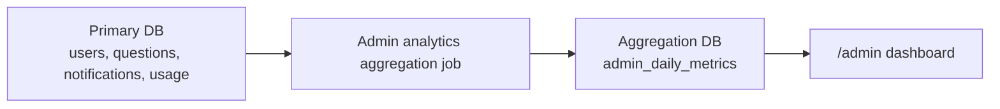

# Admin Analytics Aggregation

## Context

Admin analytics uses a separate PostgreSQL database named `buddystuddy_aggregation`.
The primary BuddyStuddy database remains the source of truth. The aggregation database stores derived read models for the admin dashboard only.

## Goals

- Keep user-facing APIs independent from admin analytics writes.
- Make analytics recoverable after process restarts or missed executions.
- Allow admin charts to read precomputed rows instead of scanning source tables on every request.

## Non-Goals

- Real-time admin analytics.
- Event-sourced metric accuracy.
- Per-request synchronous aggregation.

## Data Flow

## Scheduling

- Recent refresh: every 5 minutes, recomputes the last 2 days.
- Correction refresh: once per day, recomputes the last 30 days.
- Manual refresh: admin API can recompute a selected date range.

All writes are idempotent upserts keyed by `(metric_date, metric_key, dimension)`.
If the server stops mid-run, the next scheduled run recalculates the same date range from the source database.

## Metric Storage

`admin_daily_metrics` stores:

- `metric_date`
- `metric_key`
- `dimension`
- `value`
- `sample_count`
- `updated_at`

Rate metrics store the computed rate in `value` and the denominator in `sample_count`.

## Operational Notes

- The aggregation database can be rebuilt from the primary database.
- Admin analytics failures should not block user-facing app behavior.
- Use `ADMIN_ANALYTICS_RECENT_DAYS` and `ADMIN_ANALYTICS_CORRECTION_DAYS` to tune recovery windows.
