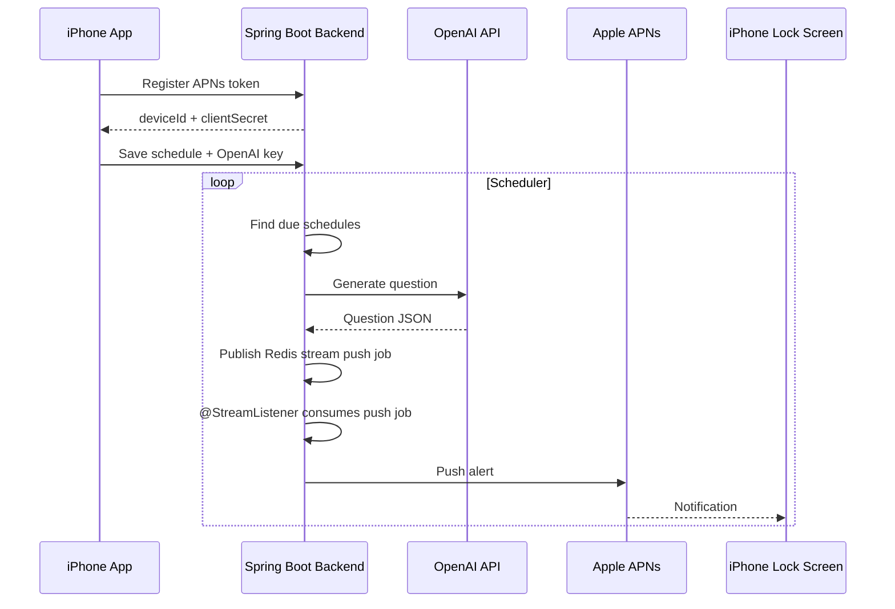

# BuddyStudy Backend APNs Deployment

## Context

The iOS app cannot reliably create new questions while force-quit or suspended. A backend is required for true APNs remote push delivery on a schedule.

## Architecture



## Source of Truth

- Local app remains the source of truth for local records unless backend sync is added later.
- Backend is the source of truth for scheduled remote-push registrations.
- Backend stores user OpenAI API keys encrypted at rest if the app sends them.

## Required Secrets

App repository:

- `DEPLOY_REPO_DISPATCH_TOKEN`: GitHub token that can dispatch workflows in `ghkdqhrbals/personal-deploy`.

Deploy repository:

- `EC2_HOST`: current EC2 public DNS, for example `ec2-3-39-42-28.ap-northeast-2.compute.amazonaws.com`
- `EC2_USER`: usually `ubuntu` or `ec2-user`, depending on the AMI.
- `EC2_SSH_PRIVATE_KEY`: private SSH key for the EC2 instance.
- `GHCR_USERNAME`: GitHub username with image pull access.
- `GHCR_TOKEN`: GitHub token with `read:packages`.
- `BACKEND_MASTER_KEY`: random base64 key for encrypting stored OpenAI keys.
- `BACKEND_API_TOKEN`: optional token required by registration/admin endpoints.
- `APNS_AUTH_KEY_P8`: raw or base64 encoded Apple APNs `.p8` key.
- `APNS_KEY_ID`: APNs key ID.
- `APNS_TEAM_ID`: Apple Developer Team ID.
- `APNS_BUNDLE_ID`: `io.github.ghkdqhrbals.StudyMate`.
- `APNS_ENV`: `production` for TestFlight/App Store.

MySQL credentials are managed in AWS Secrets Manager, not GitHub Actions Secrets.

- AWS Secrets Manager secret: `buddystudy/prod/mysql`.
- EC2 instance profile: `BuddyStudyEC2SecretsProfile`.
- Required EC2 IAM actions: `secretsmanager:GetSecretValue`, `secretsmanager:DescribeSecret`.

The AWS access key is not required for the SSH-based deployment workflow. If an AWS API based deployment is preferred, use a narrow IAM role and rotate any credentials that were pasted into chat.

## Deployment Flow

1. Manually run `Build Backend Image` in this app repository.
2. The workflow builds `backend/Dockerfile`.
3. The image is pushed to GHCR.
4. The workflow sends `repository_dispatch` to `ghkdqhrbals/personal-deploy`.
5. The deploy repository SSHes into EC2, writes `/opt/buddystudy-backend/.env`, pulls the image, and runs Docker.
6. MySQL runs as a separate Docker container with a persistent named volume.
7. The backend container stays on a private Docker network.
8. Nginx is the only public backend entrypoint and publishes HTTPS on host port `443`.

## Public Network Shape

- Public HTTPS: `https://api.ghkdqhrbals.org -> nginx:443 -> buddystudy-backend:8080`
- Backend app port `8080` is not published on the EC2 host.
- MySQL port `3306` is published on the EC2 host for production database access.
- The workflow requests/renews a Let's Encrypt certificate with the `http-01` challenge, so public port `80` is used temporarily during certificate issuance.
- If certificate issuance fails, the workflow can still keep the service reachable with a temporary self-signed certificate, but iOS production traffic should use the trusted certificate path.

Use these connection basics for database administration:

```text
host: api.ghkdqhrbals.org
port: 3306
database: buddystudy
user: buddystudy
```

The password is managed through AWS Secrets Manager at `buddystudy/prod/mysql` and mirrored on EC2 at `/opt/buddystudy-backend/.mysql_password`. Keep it private and restrict the EC2 security group if public access is no longer required.

## Data Durability

- MySQL data is stored in the `buddystudy-mysql-data` Docker volume.
- The previous SQLite volume `buddystudy-backend-data` is never deleted by the workflow.
- The current backend image is Spring Boot Kotlin. The old Python SQLite migration path is no longer executed during rollout.
- Containers use `--restart unless-stopped` so backend, Nginx, and MySQL restart after daemon or instance reboot.

Smoke-test the current EC2 deployment with:

```sh
curl -fsS https://api.ghkdqhrbals.org/health
```

## Open Questions

- Whether the app should send each user's OpenAI API key to the backend, or whether the backend should use one server-owned OpenAI API key.
- DNS for `api.ghkdqhrbals.org` must point to the EC2 host for trusted certificate issuance.
- Whether backend records should sync back into the local app history after a notification is tapped.
