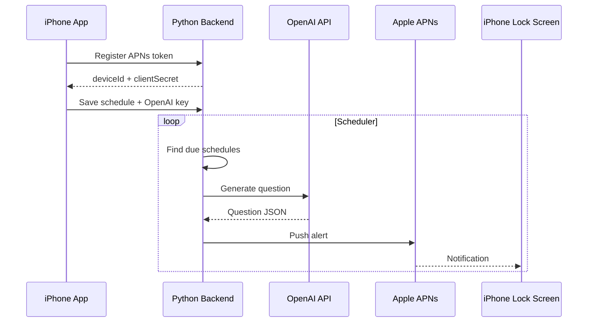

# BuddyStuddy Backend APNs Deployment

## Context

The iOS app cannot reliably create new questions while force-quit or suspended. A backend is required for true APNs remote push delivery on a schedule.

## Architecture



## Source of Truth

- Local app remains the source of truth for local records unless backend sync is added later.
- Backend is the source of truth for scheduled remote-push registrations.
- Backend stores user OpenAI API keys encrypted at rest if the app sends them.

## Required Secrets

App repository:

- `DEPLOY_REPO_DISPATCH_TOKEN`: GitHub token that can dispatch workflows in `ghkdqhrbals/personal-deploy`.

Deploy repository:

- `EC2_HOST`: `ec2-13-125-226-24.ap-northeast-2.compute.amazonaws.com`
- `EC2_USER`: usually `ubuntu` or `ec2-user`, depending on the AMI.
- `EC2_SSH_PRIVATE_KEY`: private SSH key for the EC2 instance.
- `GHCR_USERNAME`: GitHub username with image pull access.
- `GHCR_TOKEN`: GitHub token with `read:packages`.
- `BACKEND_MASTER_KEY`: random base64 key for encrypting stored OpenAI keys.
- `BACKEND_API_TOKEN`: optional token required by registration/admin endpoints.
- `APNS_AUTH_KEY_BASE64`: base64 encoded Apple APNs `.p8` key.
- `APNS_KEY_ID`: APNs key ID.
- `APNS_TEAM_ID`: Apple Developer Team ID.
- `APNS_BUNDLE_ID`: `io.github.ghkdqhrbals.StudyMate`.
- `APNS_ENV`: `production` for TestFlight/App Store.

The AWS access key is not required for the SSH-based deployment workflow. If an AWS API based deployment is preferred, use a narrow IAM role and rotate any credentials that were pasted into chat.

## Deployment Flow

1. Manually run `Build Backend Image` in this app repository.
2. The workflow builds `backend/Dockerfile`.
3. The image is pushed to GHCR.
4. The workflow sends `repository_dispatch` to `ghkdqhrbals/personal-deploy`.
5. The deploy repository SSHes into EC2, writes `/opt/buddystuddy-backend/.env`, pulls the image, and runs Docker.
6. The backend container stays on a private Docker network.
7. Nginx is the only public backend entrypoint and publishes HTTPS on host port `443`.

## Public Network Shape

- Public HTTPS: `443 -> nginx -> buddystuddy-backend:8080`
- Backend app port `8080` is not published on the EC2 host.
- The current workflow generates a self-signed certificate for deployment smoke testing.
- Production iOS traffic should use a real domain with a trusted TLS certificate. A self-signed certificate will not be acceptable for normal App Transport Security usage.

Smoke-test the current EC2 deployment with:

```sh
curl -kfsS https://ec2-13-125-226-24.ap-northeast-2.compute.amazonaws.com/health
```

## Open Questions

- Whether the app should send each user's OpenAI API key to the backend, or whether the backend should use one server-owned OpenAI API key.
- Real production domain and trusted TLS certificate automation.
- Whether backend records should sync back into the local app history after a notification is tapped.
