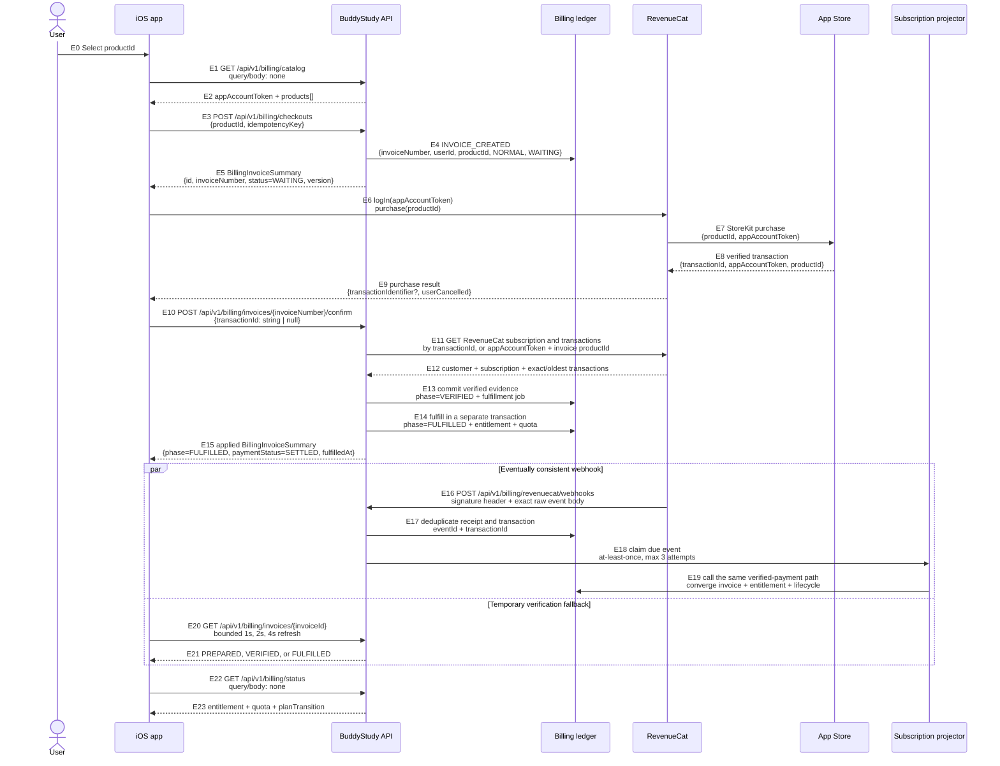

# Apple billing

BuddyStudy sells server-owned membership tiers through RevenueCat and StoreKit
2. The iOS app never grants a tier from an unverified client result. A normal
purchase sends only the transaction identifier returned by RevenueCat together
with the backend-created invoice number. The backend queries RevenueCat API v2,
checks the owning customer, product, store, environment, access state, exact
transaction, and subscription history, then writes the ledger. The signed Apple
JWS endpoint remains a recovery path for older and direct StoreKit transactions.

## At a glance

BuddyStudy separates **payment**, **subscription**, **entitlement**, and
**quota**. RevenueCat presents and observes the App Store purchase, while the
backend owns the financial ledger and every user-visible projection. A verified
charge completes its `NORMAL` invoice even if entitlement projection is delayed;
projection failure is durable retry work and never rewrites a completed charge
as a failed payment.

The membership screen uses `GET /api/v1/billing/status` as its only entitlement
and quota authority. RevenueCat `CustomerInfo` is used by the SDK only for
products, purchase, restore, and Customer Center. Selecting another product in
the same App Store subscription group supports upgrades, crossgrades, and
downgrades. A verified higher-tier transaction changes the server-owned tier
immediately. A lower-tier selection remains a pending change while the current
higher-tier period is active; only the first verified lower-tier renewal at or
after `currentPlanEndsAt` applies it. When RevenueCat is
enabled, the visible cancellation action opens Customer Center for App Store
subscriptions. Apple's native subscription management is the fallback when
RevenueCat is unavailable. Apple, not BuddyStudy or RevenueCat, makes the final
decision for an Apple refund.

When a future downgrade or cancellation is scheduled, the status response includes a
structured `planTransition`. It names the current and next tiers and gives the
exact shared boundary as `currentPlanEndsAt` and `nextPlanStartsAt`. iOS renders
that projection, including the local date, hour, and minute, as a compact
timeline; it does not infer dates from RevenueCat or the local StoreKit state.
Only future downgrades and cancellations appear in this timeline. A pending
upgrade is not presented as a future change because a verified upgrade payment
must apply the higher tier immediately. Expired or already-effective schedules
are omitted. The legacy `pendingChange` product ID remains for older clients and
follows the same rules.

## Product catalog

`membership_tier_products` maps enabled App Store product IDs to
`user_membership_tiers`. BuddyStudy offers monthly subscriptions only. Retired
product mappings remain disabled so historical renewals, refunds, and invoices
can still be reconciled without exposing those products for a new checkout.

| Tier | Monthly allowance | Product | Period | Korea price |
| --- | ---: | --- | --- | ---: |
| TIER1 | 30 | Free | — | Free |
| TIER2 | 300 | `io.github.ghkdqhrbals.StudyMate.tier2.monthly` | P1M | ₩7,900 |
| TIER3 | 1,000 | `io.github.ghkdqhrbals.StudyMate.tier3.monthly` | P1M | ₩17,900 |

The mapping is server-owned. A client-supplied product that is absent, disabled,
or has a different product type is rejected before an invoice is written.

## Ledger and state

- `invoices` is the current invoice projection.
- `invoice_events` is the append-only source of truth, ordered by an aggregate
  sequence and protected by unique event IDs.
- `payments` stores one verified Apple transaction identity and its current
  settlement projection.
- `payments_history` is the append-only verification, settlement, revocation,
  and refund history.
- `billing_actions` stores idempotent user and admin requests.
- `billing_jobs` keeps the legacy entitlement-fulfillment recovery path with a
  maximum of three attempts.
- `apple_billing_notifications` deduplicates signed App Store Server
  Notifications V2 by notification UUID.
- `revenuecat_billing_events` stores raw-body hashes and processing state for
  authenticated RevenueCat webhook events. It never replaces the Apple
  transaction ledger.
- `billing_accounts` owns the immutable one-to-one relationship between a
  BuddyStudy user and `appAccountToken`. Deletion anonymizes rather than
  reassigns this relationship.
- `subscription_events` is the append-only, idempotent provider event source;
  `subscriptions` projects one Apple `originalTransactionId` each.
- `user_entitlement_projection` selects the single highest currently valid tier
  without summing duplicate subscriptions.
- `user_quota` stores one authoritative current row per user: monthly anchor and
  boundaries, effective tier and base limit, bonus, committed and reserved
  counters, derived remaining capacity, policy version, and row version.
- `user_quota_history` is the append-only audit source for every quota mutation.
  The current-row update and its unique history event always commit in the same
  transaction.
- `quota_reservations` retains the exactly-once question-generation identity and
  the period in which the reservation was accepted, including after the current
  `user_quota` row advances.

Each billing table has an explicit Spring Data relational persistence model in
`billing/domain/entity/BillingPersistenceEntities.kt`. Closed database values
use domain enums rather than unvalidated strings, while provider-defined open
values such as RevenueCat event names remain strings. Transactional lock reads
and history reads are mapped through these models; the handwritten SQL remains
only where row locks, append-only sequencing, or atomic projection updates are
required.

Invoice changes must pass `InvoiceStateMachine`. Verified Apple notification
events and authenticated RevenueCat lifecycle events are both authoritative
inputs for refund, revocation, renewal-status, and expiration projections. They
converge on the Apple transaction ID, so whichever arrives first applies the
transition and later duplicate delivery is harmless.

For a user-initiated purchase, BuddyStudy creates a `NORMAL` invoice before
asking RevenueCat to present the App Store purchase sheet. `INVOICE_CREATED`
projects it as `WAITING` without a payment row. The API exposes the finer-grained
derived phase `PREPARED`. RevenueCat verification writes payment evidence and
exposes `VERIFIED`; membership and quota application exposes `FULFILLED`.
Internally the existing invoice projection becomes `COMPLETED` when payment
evidence commits, while `paymentStatus` and `fulfilledAt` distinguish the latter
two phases.
Entitlement projection and reconciliation proceed independently. StoreKit user
cancellation before a transaction exists makes it `FAILED`; StoreKit's `.pending`
result deliberately keeps it `WAITING` for later approval or webhook recovery.

Immediately before checkout, iOS replays verified current StoreKit entitlements
that belong to the current `appAccountToken` through the signed-JWS recovery
endpoint, then refreshes the backend-owned billing status. If the selected
product is already active, no invoice or App Store sheet is created. If the
selected product is a downgrade, no invoice is created because Apple schedules
the lower tier for the next renewal. Only a genuine subscription or immediate
plan change creates a new `WAITING` invoice. This ordering prevents a previously
purchased transaction returned by RevenueCat from being attached to a fresh
invoice.

Replaying an existing transaction is also the repair path for an inconclusive
server projection. The ledger may restore access from `UNKNOWN` to `ACTIVE`
only when the exact transaction already belongs to the same user, its invoice
is `COMPLETED` and fulfilled, its payment is `SETTLED`, and its signed expiry is
still in the future. The replay reuses the original invoice and payment and
does not infer renewal intent: `UNKNOWN` renewal remains `UNKNOWN` until a
RevenueCat lifecycle snapshot resolves it. Expired, revoked, or refunded
transactions can never reactivate access through this path.

Invoice projection status is intentionally limited to `WAITING`, `COMPLETED`,
and `FAILED`. Invoice type is `NORMAL` (일반) or `REFUND` (환불). A refund never
rewrites the completed normal invoice: it creates a separate `REFUND` invoice
linked by `original_invoice_id`. The refund invoice is `WAITING` during Apple
review, `COMPLETED` when Apple confirms the refund, and `FAILED` when Apple
declines or reverses it. Detailed provider and compensation states remain in
`invoice_events`, `payments`, `payments_history`, and `billing_actions`.

The checkout idempotency key is scoped to the authenticated user. The client
includes the returned `invoiceNumber` when confirming the RevenueCat transaction.
The Apple transaction ID is globally unique in the payment ledger and cannot be
attached to a second invoice. Initial-purchase webhooks that arrive before the
client callback recover the newest matching pending invoice by stable
`appAccountToken`, user, and product; renewals create a new invoice because each
renewal is a separate charge.

## Transaction boundaries and compensation

Payment evidence and a `COMPLETED` normal invoice commit independently from
subscription and entitlement projection. Provider receipts are inserted in a
separate transaction before lifecycle processing, so processing failure remains
observable and retryable. Projection and RevenueCat reconciliation retry at
most three times; exhausted work and its complete error remain stored for an
operator alert. A backend failure never initiates or claims an Apple refund.
Apple exposes no API that lets BuddyStudy silently cancel or refund an approved
App Store transaction. The app preserves recoverable transaction evidence and
opens Apple/RevenueCat purchase management so the user can restore the purchase
or explicitly request a refund.

RevenueCat event claims use a five-minute processing lease. A process that dies
after claiming an event cannot leave it permanently in `PROCESSING`; another
worker reclaims the expired lease. Failed Apple notifications are claimable on
redelivery, and an Apple notification left in `RECEIVED` by process death is
claimable after the same five-minute lease. Subscription projection is monotonic
by the provider event timestamp under a row lock, so a late cancellation
reversal, renewal, or purchase cannot overwrite a newer expiration or
revocation. Provider lifecycle and fulfillment paths use the same payment,
invoice, then subscription lock order. The fulfillment worker also refuses to
grant entitlement from a payment already in `REFUNDED`, `REVOKED`, or `FAILED`,
covering the boundary where a terminal Apple event commits after payment
verification but before entitlement projection. The verified-payment
transaction creates the subscription ledger row before queuing fulfillment,
and fulfillment grants membership only while that row is `ACTIVE` or
`GRACE_PERIOD`; an expiration received during the same recovery gap therefore
cannot be lost or followed by a stale membership grant.

RevenueCat completes new StoreKit transactions and returns its transaction ID to
iOS. iOS immediately confirms that transaction against the already prepared
invoice. RevenueCat also reports the same transaction through an HMAC-signed
webhook. Both inputs call the same verified-payment use case. The client performs
a short bounded invoice refresh only when RevenueCat API indexing is temporarily
behind; the durable webhook and backend recovery job remain authoritative if the
app exits or the response is delayed. The legacy signed-JWS endpoint remains for
transactions created before this migration and direct StoreKit fallback.
Therefore the failure cases converge as follows:

| Failure point | Durable source | Recovery |
| --- | --- | --- |
| Backend unavailable before checkout | No Apple charge exists | Retry checkout |
| App exits after Apple approval but before invoice refresh | RevenueCat purchase and webhook retry | Backend completes the existing invoice |
| Backend exits before payment commit | RevenueCat webhook retry | The same webhook event and transaction IDs are replayed |
| Backend exits after payment commit but before entitlement projection | `payments`, `subscription_events`, and reconciliation schedule | Projector/reconciliation rebuilds entitlement without changing the completed charge |
| Backend commits but its response is lost | Apple transaction ID and existing invoice | Client retry returns the same idempotent result |

The Apple transaction ID is the payment idempotency key. Duplicate client
callbacks, Apple server notifications, RevenueCat webhooks, and foreground
recovery cannot create a second payment or grant the membership twice.

## Purchase sequence

### Successful purchase and fulfillment

The preferred path is synchronous from the user's point of view: iOS creates a
checkout, RevenueCat completes the StoreKit purchase, and iOS always calls the
invoice confirmation endpoint. When the SDK supplies a transaction identifier,
iOS forwards it unchanged. When RevenueCat returns a successful purchase with
no `StoreTransaction`, iOS sends `transactionId: null`; the backend resolves the
newest access-granting transaction for the prepared invoice's exact
`appAccountToken` and `productId`. The backend returns success only after
payment, invoice, entitlement, and quota are durably applied. The RevenueCat
webhook and invoice refresh are recovery paths when RevenueCat API indexing is
delayed, the app exits, the response is lost, or the backend restarts.

Every authenticated iOS-to-API edge below sends these common headers. Values
are examples and secrets must never be written to logs or analytics.

| Header | Value |
| --- | --- |
| `Authorization` | `Bearer <accessToken>` |
| `X-Device-Id` | Stable registered device ID |
| `X-Client-Secret` | Device registration secret |
| `X-App-Version` | `CFBundleShortVersionString`, for example `1.1.0` |
| `X-App-Build` | `CFBundleVersion`, for example `16` |
| `Content-Type` | `application/json` for requests with a JSON body |



#### Edge contracts

`E0` is a local UI selection. The selected value must be one of the enabled
monthly `productId` values returned by `E2`; the client cannot submit an
arbitrary price, tier, currency, or allowance.

| Edge | Call and transferred values | Result and guarantee |
| --- | --- | --- |
| E1 | `GET /api/v1/billing/catalog`; no query or body; common authenticated headers | Requests the server-owned product mapping for the signed-in user. |
| E2 | `{"appAccountToken":"<uuid>","products":[{"tierCode":"TIER2","description":"...","monthlyQuestionLimit":300,"productId":"io.github.ghkdqhrbals.StudyMate.tier2.monthly","productType":"AUTO_RENEWABLE_SUBSCRIPTION","billingPeriod":"P1M","sortOrder":20}]}` | `appAccountToken` is the stable BuddyStudy billing identity and RevenueCat App User ID. Product price is still displayed from StoreKit/RevenueCat, not trusted from the client. |
| E3 | `POST /api/v1/billing/checkouts` with `{"productId":"io.github.ghkdqhrbals.StudyMate.tier2.monthly","idempotencyKey":"ios-checkout-<uuid>"}` | `productId`: 1–191 characters, `[A-Za-z0-9._-]+`. `idempotencyKey`: 8–191 characters, `[A-Za-z0-9._:-]+`, scoped to the authenticated user. |
| E4 | Internal transaction writes `INVOICE_CREATED`, invoice type `NORMAL`, status `WAITING`, authenticated `userId`, selected `tierCode/productId`, generated `invoiceNumber`, aggregate sequence and event ID. | Invoice and first event commit together. Replaying the same user-scoped idempotency key returns the existing checkout rather than creating another order. |
| E5 | `BillingInvoiceSummary`: `id`, `invoiceNumber`, `type`, `tierCode`, `productId`, `status`, `version`, payment/transaction fields, timestamps, `fulfilledAt`, `latestEventType`. At creation, payment fields and `fulfilledAt` are `null`. | The app retains both numeric `id` and UUID `invoiceNumber`: `invoiceNumber` correlates the JWS submission; `id` is used for bounded invoice reads. |
| E6 | SDK calls `Purchases.logIn(appAccountToken.lowercasedUUID)` and `Purchases.purchase(product)` where `product.productIdentifier == productId`. | RevenueCat must not remain anonymous. A different BuddyStudy account token produces an ownership conflict rather than transferring access. |
| E7 | RevenueCat/StoreKit submits the selected `productId` with the same UUID as StoreKit `appAccountToken`. Apple owns price, currency, purchase sheet, approval and subscription-group rules. | Downgrades are scheduled by Apple and do **not** create a charge invoice at this edge. Upgrades may take effect immediately under App Store rules. |
| E8-E9 | RevenueCat completes StoreKit and returns `CustomerInfo`, `userCancelled`, and usually `transactionIdentifier`. The SDK may omit `StoreTransaction` after a transfer or restoration. | The app forwards the returned identifier unchanged when present and sends `null` when absent. It does not locate, reconstruct, or submit a JWS in the RevenueCat path. `userCancelled=true` abandons the pending checkout. |
| E10 | `POST /api/v1/billing/invoices/{invoiceNumber}/confirm` with `{"transactionId":"200000000000001"}` or `{"transactionId":null}`. | The authenticated user must own the prepared invoice. A supplied transaction ID is 1–191 safe provider characters. A missing ID never skips confirmation. |
| E11-E12 | With an ID, the backend searches RevenueCat API v2 by the exact store transaction identifier. Without one, it reads the authenticated user's stable `appAccountToken`, the prepared invoice's exact `productId`, and selects the newest access-granting App Store transaction. It then fetches the oldest transaction for Apple's original transaction identity. | The backend accepts only the configured app, matching UUID customer, exact invoice product, valid environment, and access-granting status. A not-yet-indexed result is retryable, not a fabricated failure. Existing transaction/invoice uniqueness constraints prevent a historical purchase from being granted twice. |
| E13 | A transaction commits payment evidence, `PAYMENT_VERIFIED`, and a durable fulfillment job. Response phase is `VERIFIED`. | Apple `transactionId` is the payment deduplication key. A transaction already attached to another invoice is a conflict even when user and product match. |
| E14-E15 | A separate fulfillment transaction applies invoice, subscription, entitlement, and quota. Success contains `phase=FULFILLED`, `status=COMPLETED`, `paymentStatus=SETTLED`, and non-null `fulfilledAt`. | 2xx means membership application completed. Failure preserves verified evidence and returns `BILLING_APPLICATION_FAILED`; retry resumes the same invoice. |
| E16-E17 | RevenueCat webhook carries signature plus the exact raw event body. A separate receipt transaction stores provider `eventId`, raw-body SHA-256, transaction IDs, account/product, and processing state. | Delivery is at-least-once. Event ID deduplicates webhook delivery; transaction ID deduplicates payment and makes webhook/direct arrival order irrelevant. |
| E18-E19 | Worker claims due receipts in batches of at most 100 and invokes the same `VerifiedBillingPaymentUseCase` used by E10. | Failed processing retries up to three times; abandoned leases are reclaimable. Provider event ordering prevents stale lifecycle state from replacing newer state. |
| E20-E21 | `GET /api/v1/billing/invoices/{invoiceId}` returns the prepared invoice by its numeric ID. iOS retries after 1, 2, and 4 seconds only after retryable confirm errors. | Bounded polling is user feedback, not the durable mechanism. It accepts only `FULFILLED`; leaving the screen does not stop webhook recovery. |
| E22-E23 | `GET /api/v1/billing/status` returns tier, entitlement, transition, and quota. | This remains the only client authority for effective membership after purchase, restore, renewal, cancellation, or product change. |

#### Server-side failure state policy

The confirmation endpoint separates provider verification from ledger mutation.
Until RevenueCat or Apple's signed transaction has been verified, the backend
must not create a payment row, grant an entitlement, or increase quota. The
following table is the authoritative server-side behavior represented in the
interactive billing sequence explorer.

| Failure point | Classification | Invoice and ledger result | Recovery |
| --- | --- | --- | --- |
| RevenueCat has not indexed the transaction yet, request timeout, HTTP 429, or provider 5xx | Transient verification failure | The prepared invoice remains `WAITING`; no payment, entitlement, quota, or fulfillment job is written | The client performs only bounded 1s/2s/4s feedback retries. RevenueCat webhook delivery or a later confirmation converges through the same transaction ID. |
| RevenueCat server API key is missing, rejected, or lacks subscription-read access | Configuration failure | The invoice remains `WAITING`; no financial projection is changed | Return `BILLING_CONFIGURATION_ERROR`, alert operations, and retry only after configuration is repaired. |
| Transaction belongs to a different account, product/app/environment mismatch, invalid access state, or invalid Apple JWS | Permanent verification failure | The request returns `BILLING_TRANSACTION_INVALID` or `BILLING_TRANSACTION_CONFLICT`. A still-unpaid `NORMAL/WAITING` invoice receives `PAYMENT_VALIDATION_FAILED` and becomes `FAILED`. No payment, membership, entitlement, or quota state is written. | Repeating the same failure is idempotent. A verified payment can never be regressed to `FAILED`, and the failed checkout does not block a new checkout. |
| Malformed client transaction identifier | Correctable request validation failure | The request returns `VALIDATION_ERROR`; no ledger state changes and the invoice remains `WAITING`. | The client may retry the same invoice with the exact RevenueCat transaction identifier. The unpaid checkout expires after 10 minutes if it is never corrected. |
| Payment evidence commits but entitlement or quota fulfillment fails | Recoverable fulfillment failure | `PAYMENT_VERIFIED` and the payment row remain durable; the entitlement/quota transaction rolls back and the fulfillment job remains retryable | The recovery scheduler claims the job with a lease and bounded backoff. After the configured maximum attempts, it records `COMPENSATION_REQUIRED` and raises an operational alert; it never pretends Apple refunded the payment. |
| Process crashes after payment commit | Crash between transaction boundaries | The verified payment and pending fulfillment job survive restart | A later scheduler claim resumes `fulfill(invoiceId)` idempotently. |
| Duplicate client confirmation and RevenueCat webhook | At-least-once duplicate | Checkout idempotency key, provider event ID, Apple transaction ID, and the invoice-scoped quota-history event prevent duplicate invoices, payments, entitlement grants, or plan-limit mutations | Both paths converge on `VerifiedBillingPaymentUseCase`; an already fulfilled invoice is returned without applying it again. |
| Prepared checkout has no verified payment for 10 minutes | Unpaid checkout expiry | Scheduler appends `CANCELLED` with source `SYSTEM`; invoice projection moves `WAITING -> FAILED` | No refund is created because no verified charge exists. The user can start a fresh checkout. |

#### Internal transaction and idempotency boundaries

The public confirmation request is an orchestration boundary, not one database
transaction spanning RevenueCat and MySQL. Provider I/O finishes before ledger
mutation. Each persistence operation below runs through the outbound port in its
own Spring `@Transactional` boundary.

| Internal operation | Locks and writes | Idempotency and failure behavior |
| --- | --- | --- |
| `createPendingInvoice` | Locks the user's billing account, then inserts the `NORMAL/WAITING` invoice and `INVOICE_CREATED` event together | `(userId, idempotencyKey)` returns the original invoice under concurrent retries. No StoreKit sheet is shown before this commit. |
| `failPendingInvoiceValidation` | Locks the invoice and any payment for that invoice, then appends `PAYMENT_VALIDATION_FAILED` | It applies only to unpaid `NORMAL/WAITING` invoices. The event ID `invoice-payment-validation-failed:{invoiceNumber}` is unique. Repeats return the existing `FAILED` projection; an invoice with payment evidence is returned unchanged. |
| `recordVerifiedPayment` | Locks the billing account, resolves and locks the explicit or recoverable invoice, inserts the payment/history, appends `PAYMENT_VERIFIED`, upserts the subscription ledger, and inserts a fulfillment job | `(provider, transactionId)`, one-payment-per-invoice, and invoice-event IDs are unique. Client confirmation and webhook delivery therefore converge on one payment and one invoice. This transaction commits before membership fulfillment. |
| `fulfill` | Locks the invoice, verified payment, subscription projection, and `user_quota`, then applies entitlement, the idempotent plan-limit history event, payment settlement, `FULFILLED`, and fulfillment-job completion | All membership projections commit together or roll back together. Retrying the same invoice cannot change the quota row twice, and a tier change never clears current-period counters. A failure cannot erase committed payment evidence. |
| RevenueCat webhook receipt | Stores the signed raw event receipt and SHA-256 before asynchronous projection | Provider `eventId` deduplicates deliveries. A worker lease permits retry after process death; projection calls the same verified-payment use case as direct confirmation. |
| Unpaid checkout expiration | Selects old unpaid `WAITING` invoices with `FOR UPDATE SKIP LOCKED` and appends `CANCELLED` | Multiple scheduler instances cannot expire the same invoice twice. Invoices with a payment row are excluded. |

The durable billing queues use role-specific physical table names:

| Physical table | Role | Idempotency and recovery key |
| --- | --- | --- |
| `billing_fulfillment_outbox` | Verified payments waiting for entitlement and quota fulfillment | One fulfillment job per invoice and job type; leased claims resume after process death |
| `billing_revenuecat_event_inbox` | Verified RevenueCat webhook receipts | RevenueCat provider `eventId` |
| `billing_apple_notification_inbox` | Verified App Store Server Notification V2 receipts | Apple `notificationUUID` |

The migration retains `billing_jobs`, `revenuecat_billing_events`, and
`apple_billing_notifications` as writable MySQL compatibility views for one
rolling-deployment rollback window. New application code reads and writes only
the role-specific physical tables. Billing recovery pollers execute through the
managed-job lock and retry policy; they do not run as uncoordinated local loops.

`JWS` signature, RevenueCat ownership, app, environment, product, and access-state
failures are permanent only when the provider evidence proves the mismatch. The
failure recorder commits after the verification exception and records only the
invoice terminal state. A timeout, provider indexing delay, rate limit, provider
5xx, or missing server configuration does not prove that the App Store charge is
invalid, so those errors must not fail the invoice.

An immediate `WAITING -> FAILED` transition for every verification exception is
unsafe because a just-completed App Store transaction can be temporarily absent
from RevenueCat's query API. The service classifies the failure before mutating
the ledger. Permanent ownership, product, app, environment, access-state, or
Apple-signature failures append `PAYMENT_VALIDATION_FAILED`; RevenueCat indexing
delays, timeouts, 429/5xx responses, and configuration failures leave the
prepared invoice `WAITING`. A malformed client identifier also remains `WAITING`
so the same invoice can be corrected without creating a second checkout.

Apple may independently deliver App Store Server Notifications V2 to
`POST /api/v1/billing/apple/notifications`. That public endpoint has no BuddyStudy
authentication headers and accepts only
`{"signedPayload":"<Apple signed notification JWS>"}`. The backend verifies the
outer notification and nested transaction JWS, then deduplicates by Apple's
`notificationUUID` and transaction IDs. It is another durable lifecycle input,
not a client purchase-success response.

If the user cancels before Apple creates a transaction, iOS calls
`POST /api/v1/billing/checkouts/{invoiceNumber}/abandon` with the checkout UUID
as a path parameter and no body. The operation is idempotent and changes only an
unpaid `NORMAL/WAITING` checkout to `FAILED`; a checkout with verified payment
evidence cannot be abandoned.

The direct `POST /api/v1/billing/apple/transactions` endpoint accepts
`signedTransaction`, `environment`, and the optional `invoiceNumber`. It is a
preferred synchronous client-completion boundary and also a backward-compatible
recovery path for StoreKit transactions that were not created through
RevenueCat; it is not a second entitlement authority. It returns 2xx only after
the payment is `SETTLED`, the invoice has a durable `fulfilledAt`, and the
effective entitlement plus quota expose the purchased tier. If payment evidence
commits but application fails, the financial record remains durable and the
endpoint returns `BILLING_APPLICATION_FAILED`. Retrying the same JWS is
idempotent and resumes the existing fulfillment.

| Contract | Required values | Purpose |
| --- | --- | --- |
| `GET /api/v1/billing/catalog` | authenticated user | Returns server-owned products and stable `appAccountToken` |
| `POST /api/v1/billing/checkouts` | `productId`, user-scoped `idempotencyKey` | Creates the `NORMAL/WAITING` invoice before showing the purchase sheet |
| RevenueCat purchase | product, `appAccountToken` as RevenueCat App User ID | Correlates Apple purchase, RevenueCat customer, and BuddyStudy user |
| `POST /api/v1/billing/invoices/{invoiceNumber}/confirm` | RevenueCat-returned `transactionId`, or `null` when the SDK omitted `StoreTransaction` | Server verifies RevenueCat by transaction ID or by the invoice's stable account token and exact product, then applies the prepared invoice synchronously |
| `POST /api/v1/billing/revenuecat/webhooks` | exact raw body, `X-RevenueCat-Webhook-Signature` | At-least-once recovery and lifecycle delivery, converging through the same transaction ID |
| `POST /api/v1/billing/apple/transactions` | verified JWS, environment, optional invoice number | Legacy/direct StoreKit recovery using the same verified-payment use case |
| `GET /api/v1/billing/invoices/{invoiceId}` | invoice ID owned by the user | Bounded client refresh; it does not replace webhook recovery |

### App Store succeeds but backend fulfillment fails

This case must not be displayed as an ordinary purchase cancellation. The user
may already have been charged. Once verified payment evidence exists, the
invoice is excluded from the ten-minute unpaid-checkout expiration job. The
backend retries entitlement projection with a durable lease and bounded
backoff. The third failure preserves the completed invoice and payment evidence,
retains the failed event, and raises an operator alert. It does not initiate an
automatic refund.

Required behavior by failure class:

| Evidence and state | User meaning | Client action |
| --- | --- | --- |
| `FAILED` + `CANCELLED`, no payment evidence | Purchase sheet was cancelled or unpaid checkout expired | Allow retry; refund language is unnecessary |
| `COMPLETED` charge + stale/unknown entitlement | Purchase succeeded and backend projection is still running | Show non-blocking "Confirming purchase" from `GET /api/v1/billing/status` and refresh with a bounded wait |
| Failed subscription projection after three attempts | Charge is preserved; operator reconciliation is required | Keep access status explicit, alert operations, and offer restore/Customer Center without claiming a refund occurred |
| Linked `REFUND/WAITING` | Apple refund decision is pending | Show "Refund under review"; do not remove the original ledger entry |
| Linked `REFUND/COMPLETED` | Apple confirmed the refund | Reconcile entitlement and quota, then show the final refund record |

The client decides entitlement copy from `GET /api/v1/billing/status`, not from
RevenueCat active subscriptions, invoice status, or HTTP success alone. A
Customer Center callback such as `onCustomerCenterRefundRequestCompleted` is
useful for UI refresh and analytics only; it must never project `REFUNDED` in
the backend. Only a verified RevenueCat or Apple server lifecycle event can do
that.

After a RevenueCat purchase callback, iOS always calls the confirmation endpoint,
forwarding the SDK's transaction ID when available and `null` otherwise. It
accepts success only for a `FULFILLED`
`COMPLETED`/`SETTLED` invoice with `fulfilledAt`. It must not use `try?`, invent
an invoice, or convert a deterministic server failure into an approval-pending
alert. Bounded webhook fallback is allowed only for 429/5xx confirmation errors.
If it does not reach the same applied-invoice contract, the app shows a failure
and offers purchase restoration as recovery.

A RevenueCat `TRANSFER` webhook is also a durable recovery signal. Its
`transferred_to` UUID is normalized to the BuddyStudy `appAccountToken`. If that
user has a prepared invoice, the worker verifies the newest access-granting
transaction for the invoice's exact product and invokes the same idempotent
verified-payment use case. The webhook cannot create a second payment or attach
the transaction to a different user's invoice.

## RevenueCat Customer Center

BuddyStudy's App Store storefront is monthly-only. Tier selection and plan
changes belong to the app's membership screen, which loads only the active
`P1M` products returned by the backend catalog. RevenueCat Customer Center is a
support and recovery surface, not a plan picker.

Configure it under RevenueCat Project Settings > Monetization Tools > Customer
Center, and keep only the following active-subscriber paths enabled:

1. **Missing Purchase** for restore and account-correlation recovery.
2. **Manage** for Apple's subscription management and cancellation.
3. **Refund Request** for a paid purchase that BuddyStudy could not fulfill.

**Change Plans must remain disabled.** RevenueCat may build that screen from
the complete App Store subscription group, including canceled historical
products. Enabling it can therefore surface the retired Tier 2 and Tier 3
annual products even though the backend catalog and current offering contain
only monthly products. Annual App Store records are retained for historical
transaction reconciliation only; they must not be added to an offering,
paywall, Customer Center plan-change path, or backend active catalog.

The active-subscription and inactive-subscription screens must use localized
Korean, English, and Japanese labels. Configure a support email for a missing
purchase that cannot be restored. The app presents `CustomerCenterView` as a
sheet and refreshes billing, membership, and quota after dismissal. If Customer
Center cannot be loaded, the fallback is Apple's refund support page; BuddyStudy
must not claim that it issued a refund.

References:

- [RevenueCat Customer Center configuration](https://www.revenuecat.com/docs/tools/customer-center/customer-center-configuration)
- [RevenueCat Customer Center iOS integration](https://www.revenuecat.com/docs/tools/customer-center/customer-center-integration-ios)
- [RevenueCat refund handling](https://www.revenuecat.com/docs/subscription-guidance/refunds)

### Reliability and verification requirements

- Persist checkout and payment evidence before granting access.
- Deduplicate by checkout idempotency key, RevenueCat event ID, and Apple transaction ID.
- Never expire or delete an invoice that has verified payment evidence.
- Keep projection and reconciliation retries bounded; terminal failure must preserve the completed charge, failed event, and full error for operator reconciliation.
- Treat RevenueCat and Apple webhooks as at-least-once and safe to replay.
- Alert on delayed webhooks, entitlement mismatch, reconciliation exhaustion, stale quota reservations, negative counters, ownership conflict, duplicate active subscriptions, and refunds pending beyond the operational threshold.
- Test purchase success, app termination after Apple approval, duplicate and out-of-order webhooks, backend restart between payment and entitlement commits, exhausted projection recovery, restore, refund approval, refund decline, and refund reversal.

RevenueCat owns App Store transaction completion
(`purchasesAreCompletedBy: .revenueCat`). The stable BuddyStudy
`appAccountToken` is the RevenueCat App User ID, so a purchase can be recovered
without matching on email or device. The
backend also resolves RevenueCat's `original_app_user_id` and aliases to survive
customer identity changes. RevenueCat purchase and lifecycle webhooks are the
primary server-delivered path; the direct signed-JWS endpoint remains a
backward-compatible recovery path. `CANCELLATION` with `CUSTOMER_SUPPORT`
requests an immediate CustomerInfo reconciliation; it does not revoke the
current entitlement or complete a refund invoice from that event alone.
Ordinary cancellation only disables renewal until a later `EXPIRATION` event
removes access. Verified provider refund evidence creates the linked refund
invoice and converges on the Apple transaction ID and invoice event ledger.

Apple does not provide a server API that lets BuddyStudy unilaterally issue an
App Store refund or cancel a user's subscription. iOS starts the system refund
sheet with `Transaction.beginRefundRequest`; subscription cancellation opens
Apple's subscription management. Admin actions create a durable audited request
and operational state. The final result always comes back through a verified
Apple server notification, and no admin endpoint can forge a completed refund.

## Subscription, entitlement, and quota lifecycle

`subscriptions` deliberately separates access and renewal:

- `access_status`: `PENDING`, `ACTIVE`, `GRACE_PERIOD`, `EXPIRED`, `REVOKED`,
  `TRANSFERRED`, or `UNKNOWN`.
- `renewal_status`: `WILL_RENEW`, `CANCELED`, `BILLING_RETRY`,
  `NOT_APPLICABLE`, or `UNKNOWN`.

Cancellation only changes renewal and retains paid access through expiration.
Product-change notices record `pending_product_id`; the effective tier changes
only when a verified entitlement snapshot changes. Billing retry reconciles at
15-minute intervals, ordinary active subscriptions every six hours, and ended
subscriptions daily. Customer-support refund notices force reconciliation so a
historical refund cannot revoke a newer valid subscription. If multiple valid
subscriptions exist, the highest tier wins and limits are never added together.

### Monthly question policy v5

`user_quota` is the only current-state read authority. It stores the user's
anchor, current `period_started_at` and `period_ends_at`, effective tier and base
limit, current-period bonus, committed and reserved counts, policy version, and
row version. Remaining quota is derived as:

```text
max(0, base_limit + bonus_limit - committed_count - reserved_count)
```

The monthly anchor starts at account creation. The first verified paid purchase
may replace it once with the earliest provider `purchasedAt`; existing committed,
reserved, and bonus counters are carried into the recalculated window rather
than cleared. Later upgrades, downgrades, same-tier renewals, cancellations,
expirations, refunds, and resubscriptions never move the anchor. UTC month
arithmetic preserves the original day without drift, including January 31 →
February end → March 31.

Tier changes use these rules:

- Upgrade: the higher tier and base limit apply immediately. The current period,
  committed usage, bonus, and active reservations remain unchanged. For example,
  20 committed and 2 reserved in TIER1 becomes 278 remaining in TIER2.
- Downgrade request before `currentPlanEndsAt`: the higher tier and quota row
  remain unchanged. Only `pending_product_id` and the exact transition boundary
  are exposed.
- First verified lower-tier renewal at or after `currentPlanEndsAt`: the lower
  tier and base limit become effective while period and counters remain. If the
  preserved committed plus reserved total is at least the lower allowance,
  remaining is zero until the natural monthly rollover.
- Same-tier renewal changes neither the quota row nor its history. Cancellation,
  expiration, refund, and resubscription follow the effective entitlement tier
  without granting a fresh allowance inside the same quota period.
- Each effective invoice uses one unique plan-change history event. Client
  confirmation, webhook delivery, reconciliation, and replay therefore converge
  without a second mutation. A deferred downgrade writes no quota change until
  its lower-tier renewal becomes effective.

Example: a TIER3 user with 320 committed questions, 5 active reservations, and
10 bonus questions selects TIER2. Until the TIER3 period ends the full TIER3
state remains active. When TIER2 becomes effective, the base becomes 300 while
all counters remain; remaining is `max(0, 300 + 10 - 320 - 5) = 0`. The counters
reset only at the next natural quota boundary.

Question generation uses its Saga correlation ID as an exactly-once quota key:

1. Acceptance stores a `quota_reservations` row, appends `RESERVED`, and
   increments `user_quota.reserved_count` atomically.
2. A usable persisted system question appends `COMMITTED`, moves one current
   reservation into committed usage, and marks the reservation committed.
3. Permanent generation failure or rollback appends `RELEASED` and reverses the
   appropriate current-period counter exactly once.
4. Replayed requests return the existing reservation result without advancing
   the quota version.

Reservations snapshot their accepted period and are retained after rollover. A
late commit or release for an older-period reservation finalizes that reservation
and appends its history, but it does not modify the counters of the new current
period.

Every mutation appends one `user_quota_history` row in the same transaction as
the `user_quota` update. History includes a unique event ID, mutation type,
period, deltas, tier and limit before/after values, reason, timestamp, and the
resulting row version. Types include `PERIOD_RESET`, `RESERVED`, `COMMITTED`,
`RELEASED`, `PLAN_UPGRADED`, `PLAN_DOWNGRADED`, `BONUS_GRANTED`,
`BONUS_REVOKED`, `ADMIN_ADJUSTED`, and `MIGRATION_ADJUSTMENT`.

The managed `user-quota-rollover` job runs every minute. It claims due rows with
bounded locking, advances an overdue row directly to the monthly window
containing the current UTC instant, resets committed, reserved, and bonus
counters, and appends one deterministic `PERIOD_RESET` history event. Quota
reads and writes invoke the same idempotent rollover transaction whenever they
encounter `period_ends_at <= now`, so scheduler delay, process downtime, or a
race between the job and a request cannot expose or reset an allowance twice.
Administrative bonuses remain current-period history events and expire only at
this natural rollover.

Every five minutes the backend records `billing_lifecycle_metrics` for webhook
lag, entitlement mismatch, exhausted reconciliation, stale reservations,
negative counters, duplicate active subscriptions, and ownership conflicts.
An anomalous snapshot is emitted as `billing_lifecycle_anomaly` at ERROR; the
existing Grafana/Loki operational-error rule owns Slack notification. The
backend never calls Slack directly.

## API

User endpoints:

- `GET /api/v1/billing/catalog`
- `GET /api/v1/billing/status`
- `POST /api/v1/billing/checkouts`
- `POST /api/v1/billing/checkouts/{invoiceNumber}/abandon`
- `POST /api/v1/billing/apple/transactions`
- `GET /api/v1/billing/invoices`
- `GET /api/v1/billing/invoices/{invoiceId}`
- `POST /api/v1/billing/payments/{paymentId}/refund-requests`
- `POST /api/v1/billing/subscriptions/{originalTransactionId}/cancellation-requests`

Apple public webhook:

- `POST /api/v1/billing/apple/notifications`

RevenueCat public webhook:

- `POST /api/v1/billing/revenuecat/webhooks`

RevenueCat signs the exact raw request body with
`X-RevenueCat-Webhook-Signature`. The backend rejects stale timestamps and
invalid HMAC-SHA256 signatures before recording an event. Delivery is
at-least-once and is deduplicated by RevenueCat event ID.

`NORMAL/WAITING` checkout invoices without verified payment evidence expire
ten minutes after creation. The managed `billing-fulfillment-recovery` job
records a deterministic `SYSTEM/CANCELLED` invoice event and projects the
invoice as `FAILED`. Paid invoices and `REFUND` invoices are never selected by
checkout expiration.

The invoice API includes the aggregate's latest event type so the client can
distinguish a cancelled checkout from other `FAILED` outcomes. Billing history
routes cancelled checkouts, refunds, purchase restoration, and subscription
management through RevenueCat Customer Center. The app never grants an Apple
refund itself; the user completes the supported Apple flow and RevenueCat
webhooks eventually reconcile the payment and invoice projections.

Admin endpoints:

- `GET /api/v1/admin/billing/invoices`
- `GET /api/v1/admin/billing/invoices/{invoiceId}`
- `POST /api/v1/admin/billing/invoices/{invoiceId}/refund-requests`
- `POST /api/v1/admin/billing/invoices/{invoiceId}/cancellation-requests`
- `GET /api/v1/admin/users/{userId}/billing/timeline`
- `POST /api/v1/admin/users/{userId}/billing/reconcile`
- `POST /api/v1/admin/users/{userId}/quota-adjustments`

Checkout creation and billing actions require a validated idempotency key. The
transaction-sync endpoint is idempotent by Apple's transaction ID, and checkout
abandonment is idempotent by invoice state. Admin endpoints use the existing
monitoring administrator session. The monitoring UI exposes the flow at
`/orders.html`.

## Production setup

1. Keep the two monthly products in the single `BuddyStudy Membership`
   auto-renewable subscription group. TIER3 is group level 1 and TIER2 is group
   level 2. Retired products must not be included in the RevenueCat offering.
2. The Sandbox App Store Server Notifications V2 URL is
   `https://api.ghkdqhrbals.org/api/v1/billing/apple/notifications`. Configure
   the production URL separately before the App Store release.
3. Keep bundle ID `io.github.ghkdqhrbals.StudyMate` and numeric App Store app ID
   `6774108938` aligned with the release app.
4. Apple Root CA G2 and G3 public certificates are bundled from Apple PKI. They
   may be overridden with `APPLE_IAP_ROOT_CERTIFICATES_BASE64` when rotating
   trust material.
5. Production online certificate checks remain enabled. Xcode StoreKit
   transactions are accepted only in the development profile.
6. Add the RevenueCat Apple public SDK key as the iOS release secret
   `REVENUECAT_PUBLIC_SDK_KEY`. Add each environment's own
   `REVENUECAT_WEBHOOK_SIGNING_SECRET` to its backend application secret.
   Add a RevenueCat V2 secret key with customer-read permission as
   `REVENUECAT_SERVER_API_KEY`; `REVENUECAT_PROJECT_ID` is required for the
   six-hour/15-minute/daily server reconciliation schedule. Configure bounded
   connect/read timeouts and at most three attempts. `REVENUECAT_APP_ID` remains
   optional scoping metadata. The production-only App Store webhook targets
   `https://api.ghkdqhrbals.org/api/v1/billing/revenuecat/webhooks`; the Sandbox
   webhook accepts Sandbox events for the App Store app and
   targets `https://lowfidev.cloud/api/v1/billing/revenuecat/webhooks`.
7. RevenueCat must own transaction completion and use the same two monthly App
   Store product IDs. Retired annual products remain available only for historical
   transaction, entitlement, and refund processing; they must not appear in an
   Offering or remain available for sale in App Store Connect. Debug, ordinary
   TestFlight, and App Store builds use the `appl_`
   Apple public key so StoreKit determines Apple Sandbox versus Production from
   the transaction environment. TestFlight always uses the `appl_` key,
   including when developer access points API traffic at the development
   backend. The app does not embed or select a RevenueCat Test Store key.
   RevenueCat remains configured once per process with the `appl_` key. Release
   validates that the public key starts with `appl_`.
8. TestFlight is detected from its `sandboxReceipt` and always uses
   `https://lowfidev.cloud`, regardless of persisted developer settings or the
   launch environment override. App Store builds use the production API. This
   keeps TestFlight checkouts and the Sandbox-only RevenueCat webhook on the
   same development billing ledger.

The committed App Store Connect source of truth is
`app-store/billing/subscriptions.json`. Product metadata can take up to one hour
to propagate to Sandbox. A Sandbox Apple Account must be created in App Store
Connect's Users and Access page because Apple exposes only lookup and mutation,
not tester creation, through the public API.

StoreKit products and server notifications still require App Store Connect
agreements, tax/banking setup, review screenshots, and review approval before
real purchases can complete.

## Development and Sandbox setup

- The shared `StudyMateiOS` Debug launch action uses `StudyMateDev.storekit`.
  Simulator and Xcode-launched device purchases therefore return `XCODE`
  transactions while still creating the same backend `NORMAL/WAITING` invoice
  before the StoreKit sheet and synchronizing the transaction JWS afterward.
- The same launch action injects `BUDDYSTUDY_BACKEND_BASE_URL=https://lowfidev.cloud`,
  keeping the local StoreKit transaction and its pending invoice on the dev
  backend even when the installation previously selected the production API.
- The backend `dev` profile accepts `XCODE` transactions and verifies their
  bundle ID, product mapping, `appAccountToken`, invoice, and transaction data.
  Apple does not sign Xcode-local test data, so this environment is never
  enabled by the production profile.
- Xcode-local transactions do not produce App Store Server Notifications, so
  development recovery deliberately uses the same StoreKit unfinished-
  transaction replay path as production.
- To exercise Apple's actual Sandbox, run a development-signed build without
  the scheme StoreKit configuration and sign in with an App Store Connect
  Sandbox Apple Account. Those transactions are marked `SANDBOX` and use the
  same dev API and invoice lifecycle.
- `StudyMateDev.storekit` and `app-store/billing/subscriptions.json` must retain
  identical product IDs and Korean base prices; the iOS policy test guards this
  contract.
