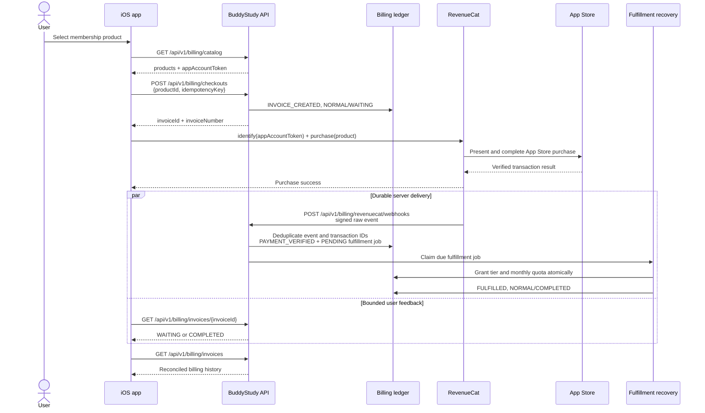
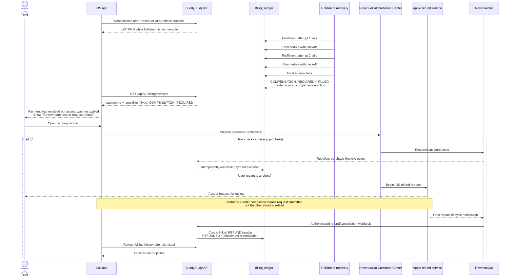

# Apple billing

BuddyStudy sells server-owned membership tiers through StoreKit 2. The iOS app
never grants a tier from an unverified client result. It sends Apple's signed
transaction JWS to the backend with the stable per-user `appAccountToken`; the
backend verifies the signature, bundle ID, App Store app ID, environment,
product mapping, account token, timestamps, amount fields, and transaction
identity before writing the ledger.

## At a glance

BuddyStudy separates **purchase approval**, **payment evidence**, and
**membership fulfillment**. RevenueCat presents and observes the App Store
purchase, while the backend owns invoices, verified payment records, membership
access, and monthly quota. A successful purchase sheet therefore does not by
itself grant access: the invoice becomes `COMPLETED` only after verified payment
evidence and membership fulfillment have both committed.

The user-facing recovery surface is RevenueCat Customer Center. It provides
missing-purchase restoration, subscription cancellation, iOS refund requests,
and plan management according to the remote RevenueCat configuration. Apple,
not BuddyStudy or RevenueCat, makes the final decision for an Apple refund.

## Product catalog

`membership_tier_products` maps enabled App Store product IDs to
`user_membership_tiers`. Monthly and annual products grant the same monthly
allowance; only the Apple renewal period and price differ.

| Tier | Monthly allowance | Product | Period | Korea price |
| --- | ---: | --- | --- | ---: |
| TIER1 | 30 | Free | — | Free |
| TIER2 | 300 | `io.github.ghkdqhrbals.StudyMate.tier2.monthly` | P1M | ₩7,900 |
| TIER2 | 300 | `io.github.ghkdqhrbals.StudyMate.tier2.yearly` | P1Y | ₩69,000 |
| TIER3 | 1,000 | `io.github.ghkdqhrbals.StudyMate.tier3.monthly` | P1M | ₩17,900 |
| TIER3 | 1,000 | `io.github.ghkdqhrbals.StudyMate.tier3.yearly` | P1Y | ₩149,000 |

The mapping is server-owned. A client-supplied product that is absent, disabled,
or has a different product type is rejected before an invoice is written.

## Ledger and state

- `invoices` is the current invoice projection.
- `invoice_events` is the append-only source of truth, ordered by an aggregate
  sequence and protected by unique event IDs.
- `payments` stores one verified Apple transaction identity and its current
  settlement projection.
- `payments_history` is the append-only verification, settlement, revocation,
  and refund history.
- `billing_actions` stores idempotent user, admin, and compensation requests.
- `billing_jobs` durably records fulfillment or compensation work with a
  maximum of three attempts.
- `apple_billing_notifications` deduplicates signed App Store Server
  Notifications V2 by notification UUID.
- `revenuecat_billing_events` stores raw-body hashes and processing state for
  authenticated RevenueCat webhook events. It never replaces the Apple
  transaction ledger.

Each billing table has an explicit Spring Data relational persistence model in
`billing/domain/entity/BillingPersistenceEntities.kt`. Closed database values
use domain enums rather than unvalidated strings, while provider-defined open
values such as RevenueCat event names remain strings. Transactional lock reads
and history reads are mapped through these models; the handwritten SQL remains
only where row locks, append-only sequencing, or atomic projection updates are
required.

Invoice changes must pass `InvoiceStateMachine`. Verified Apple notification
events and authenticated RevenueCat lifecycle events are both authoritative
inputs for refund, revocation, renewal-status, and expiration projections. They
converge on the Apple transaction ID, so whichever arrives first applies the
transition and later duplicate delivery is harmless.

For a user-initiated purchase, BuddyStudy creates a `NORMAL` invoice before
asking RevenueCat to present the App Store purchase sheet. `INVOICE_CREATED` projects it as `WAITING`
without a payment row. Payment verification and membership fulfillment remain
detailed events while the public invoice status stays `WAITING`. It becomes
`COMPLETED` only after the verified Apple payment has successfully applied the
membership entitlement and monthly question allowance. StoreKit user
cancellation or fulfillment failure makes it `FAILED`; StoreKit's `.pending`
result deliberately keeps it `WAITING` for later approval or webhook recovery.

Invoice projection status is intentionally limited to `WAITING`, `COMPLETED`,
and `FAILED`. Invoice type is `NORMAL` (일반) or `REFUND` (환불). A refund never
rewrites the completed normal invoice: it creates a separate `REFUND` invoice
linked by `original_invoice_id`. The refund invoice is `WAITING` during Apple
review, `COMPLETED` when Apple confirms the refund, and `FAILED` when Apple
declines or reverses it. Detailed provider and compensation states remain in
`invoice_events`, `payments`, `payments_history`, and `billing_actions`.

The checkout idempotency key is scoped to the authenticated user. The client
includes the returned `invoiceNumber` when synchronizing JWS. Initial-purchase
notifications that arrive before the client callback recover the newest matching
pending invoice by stable `appAccountToken`, user, and product; renewals create a
new invoice because each renewal is a separate charge.

## Transaction boundaries and compensation

Payment evidence and a `PENDING` fulfillment job commit atomically before
membership fulfillment. Fulfillment runs in a separate transaction. A managed
recovery job claims due work every five seconds and also reclaims `PROCESSING`
work whose two-minute lease expired after process death. Transient failures use
bounded backoff. Only the third failed attempt records
`COMPENSATION_REQUIRED`, fails the fulfillment job, creates a compensation job,
and creates a required compensation action. This preserves proof of the charge
and avoids treating one transient database failure as a refund case.

RevenueCat completes new StoreKit transactions and reports them through an
HMAC-signed webhook. The iOS client performs a short bounded invoice refresh;
the durable webhook and backend recovery job remain authoritative if the app
exits or the response is delayed. The legacy signed-JWS endpoint and unfinished
transaction listener remain for transactions created before this migration.
Therefore the failure cases converge as follows:

| Failure point | Durable source | Recovery |
| --- | --- | --- |
| Backend unavailable before checkout | No Apple charge exists | Retry checkout |
| App exits after Apple approval but before invoice refresh | RevenueCat purchase and webhook retry | Backend completes the existing invoice |
| Backend exits before payment commit | RevenueCat webhook retry | The same webhook event and transaction IDs are replayed |
| Backend exits after payment commit but before entitlement commit | `payments`, `payments_history`, and `billing_jobs` | Backend recovery job fulfills membership |
| Backend commits but its response is lost | Apple transaction ID and existing invoice | Client retry returns the same idempotent result |

The Apple transaction ID is the payment idempotency key. Duplicate client
callbacks, Apple server notifications, RevenueCat webhooks, and foreground
recovery cannot create a second payment or grant the membership twice.

## Purchase sequence

### Successful purchase and fulfillment

The normal RevenueCat path is asynchronous after App Store approval. The iOS
app briefly refreshes the invoice for immediate feedback, but the signed
RevenueCat webhook and the durable fulfillment job are the recovery path when
the app closes, loses its response, or the backend restarts.

The direct `POST /api/v1/billing/apple/transactions` endpoint accepts
`signedTransaction`, `environment`, and the optional `invoiceNumber`. It is a
backward-compatible recovery path for StoreKit transactions that were not
created through RevenueCat; it is not a second entitlement authority.

| Contract | Required values | Purpose |
| --- | --- | --- |
| `GET /api/v1/billing/catalog` | authenticated user | Returns server-owned products and stable `appAccountToken` |
| `POST /api/v1/billing/checkouts` | `productId`, user-scoped `idempotencyKey` | Creates the `NORMAL/WAITING` invoice before showing the purchase sheet |
| RevenueCat purchase | product, `appAccountToken` as RevenueCat App User ID | Correlates Apple purchase, RevenueCat customer, and BuddyStudy user |
| `POST /api/v1/billing/revenuecat/webhooks` | exact raw body, `X-RevenueCat-Webhook-Signature` | Primary at-least-once server delivery, deduplicated by event and transaction IDs |
| `GET /api/v1/billing/invoices/{invoiceId}` | invoice ID owned by the user | Bounded client refresh; it does not replace webhook recovery |

### App Store succeeds but backend fulfillment fails

This case must not be displayed as an ordinary purchase cancellation. The user
may already have been charged. Once verified payment evidence exists, the
invoice is excluded from the ten-minute unpaid-checkout expiration job. The
backend retries fulfillment with a durable lease and bounded backoff. The third
failure records `COMPENSATION_REQUIRED`, marks the invoice `FAILED`, and creates
an audited compensation action without deleting payment evidence.

Required behavior by failure class:

| Evidence and state | User meaning | Client action |
| --- | --- | --- |
| `FAILED` + `CANCELLED`, no payment evidence | Purchase sheet was cancelled or unpaid checkout expired | Allow retry; refund language is unnecessary |
| `WAITING` + verified payment | Purchase succeeded and backend recovery is still running | Show non-blocking "Confirming purchase" and refresh with a bounded wait |
| `FAILED` + `COMPENSATION_REQUIRED` and `paymentId` | Charge exists but access could not be applied | Present RevenueCat Customer Center with missing-purchase and refund paths |
| Linked `REFUND/WAITING` | Apple refund decision is pending | Show "Refund under review"; do not remove the original ledger entry |
| Linked `REFUND/COMPLETED` | Apple confirmed the refund | Reconcile entitlement and quota, then show the final refund record |

The client must decide the recovery copy from `latestEventType` and payment
evidence, not from HTTP success or the coarse `FAILED` status alone. A
Customer Center callback such as `onCustomerCenterRefundRequestCompleted` is
useful for UI refresh and analytics only; it must never project `REFUNDED` in
the backend. Only a verified RevenueCat or Apple server lifecycle event can do
that.

## RevenueCat Customer Center

RevenueCat's default iOS Customer Center configuration supports cancellation,
missing purchases, refund requests, and plan changes. Configure it under
RevenueCat Project Settings > Monetization Tools > Customer Center, and keep
the following BuddyStudy paths enabled:

1. **Missing Purchase** for restore and account-correlation recovery.
2. **Refund Request** for a paid purchase that BuddyStudy could not fulfill.
3. **Cancel Subscription** for stopping future renewals; cancellation is not a refund.
4. **Change Plans** when membership upgrades or downgrades are enabled.

The active-subscription and inactive-subscription screens must use localized
Korean, English, and Japanese labels. Configure a support email for a missing
purchase that cannot be restored. The app presents `CustomerCenterView` as a
sheet and refreshes billing, membership, and quota after dismissal. If Customer
Center cannot be loaded, the fallback is Apple's refund support page; BuddyStudy
must not claim that it issued a refund.

References:

- [RevenueCat Customer Center configuration](https://www.revenuecat.com/docs/tools/customer-center/customer-center-configuration)
- [RevenueCat Customer Center iOS integration](https://www.revenuecat.com/docs/tools/customer-center/customer-center-integration-ios)
- [RevenueCat refund handling](https://www.revenuecat.com/docs/subscription-guidance/refunds)

### Reliability and verification requirements

- Persist checkout and payment evidence before granting access.
- Deduplicate by checkout idempotency key, RevenueCat event ID, and Apple transaction ID.
- Never expire or delete an invoice that has verified payment evidence.
- Keep fulfillment retries bounded; terminal failure must create an audited compensation action.
- Treat RevenueCat and Apple webhooks as at-least-once and safe to replay.
- Alert on `COMPENSATION_REQUIRED`, failed webhook verification, fulfillment retry exhaustion, and refunds pending beyond the operational threshold.
- Test purchase success, app termination after Apple approval, duplicate and out-of-order webhooks, backend restart between payment and fulfillment commits, terminal compensation, restore, refund approval, refund decline, and refund reversal.

RevenueCat owns transaction completion (`purchasesAreCompletedBy: .revenueCat`)
in both the App Store and RevenueCat Test Store. The stable BuddyStudy
`appAccountToken` is the RevenueCat App User ID, so a purchase can be recovered
without matching on email or device. The
backend also resolves RevenueCat's `original_app_user_id` and aliases to survive
customer identity changes. RevenueCat purchase and lifecycle webhooks are the
primary server-delivered path; the direct signed-JWS endpoint remains a
backward-compatible recovery path. `CANCELLATION` with `CUSTOMER_SUPPORT` completes a linked refund
invoice, while ordinary cancellation only disables renewal until a later
`EXPIRATION` event removes access. Both paths converge on the same Apple
transaction ID and invoice event ledger.

Apple does not provide a server API that lets BuddyStudy unilaterally issue an
App Store refund or cancel a user's subscription. iOS starts the system refund
sheet with `Transaction.beginRefundRequest`; subscription cancellation opens
Apple's subscription management. Admin actions create a durable audited request
and operational state. The final result always comes back through a verified
Apple server notification, and no admin endpoint can forge a completed refund.

## API

User endpoints:

- `GET /api/v1/billing/catalog`
- `POST /api/v1/billing/checkouts`
- `POST /api/v1/billing/checkouts/{invoiceNumber}/abandon`
- `POST /api/v1/billing/apple/transactions`
- `GET /api/v1/billing/invoices`
- `GET /api/v1/billing/invoices/{invoiceId}`
- `POST /api/v1/billing/payments/{paymentId}/refund-requests`
- `POST /api/v1/billing/subscriptions/{originalTransactionId}/cancellation-requests`

Apple public webhook:

- `POST /api/v1/billing/apple/notifications`

RevenueCat public webhook:

- `POST /api/v1/billing/revenuecat/webhooks`

RevenueCat signs the exact raw request body with
`X-RevenueCat-Webhook-Signature`. The backend rejects stale timestamps and
invalid HMAC-SHA256 signatures before recording an event. Delivery is
at-least-once and is deduplicated by RevenueCat event ID.

`NORMAL/WAITING` checkout invoices without verified payment evidence expire
ten minutes after creation. The managed `billing-fulfillment-recovery` job
records a deterministic `SYSTEM/CANCELLED` invoice event and projects the
invoice as `FAILED`. Paid invoices and `REFUND` invoices are never selected by
checkout expiration.

The invoice API includes the aggregate's latest event type so the client can
distinguish a cancelled checkout from other `FAILED` outcomes. Billing history
routes cancelled checkouts, refunds, purchase restoration, and subscription
management through RevenueCat Customer Center. The app never grants an Apple
refund itself; the user completes the supported Apple flow and RevenueCat
webhooks eventually reconcile the payment and invoice projections.

Admin endpoints:

- `GET /api/v1/admin/billing/invoices`
- `GET /api/v1/admin/billing/invoices/{invoiceId}`
- `POST /api/v1/admin/billing/invoices/{invoiceId}/refund-requests`
- `POST /api/v1/admin/billing/invoices/{invoiceId}/cancellation-requests`

Checkout creation and billing actions require a validated idempotency key. The
transaction-sync endpoint is idempotent by Apple's transaction ID, and checkout
abandonment is idempotent by invoice state. Admin endpoints use the existing
monitoring administrator session. The monitoring UI exposes the flow at
`/orders.html`.

## Production setup

1. Keep all four products in the single `BuddyStudy Membership` auto-renewable
   subscription group. TIER3 is group level 1 and TIER2 is group level 2;
   monthly and annual products for the same tier share a level.
2. The Sandbox App Store Server Notifications V2 URL is
   `https://api.ghkdqhrbals.org/api/v1/billing/apple/notifications`. Configure
   the production URL separately before the App Store release.
3. Keep bundle ID `io.github.ghkdqhrbals.StudyMate` and numeric App Store app ID
   `6774108938` aligned with the release app.
4. Apple Root CA G2 and G3 public certificates are bundled from Apple PKI. They
   may be overridden with `APPLE_IAP_ROOT_CERTIFICATES_BASE64` when rotating
   trust material.
5. Production online certificate checks remain enabled. Xcode StoreKit
   transactions are accepted only in the development profile.
6. Add the RevenueCat Apple public SDK key as the iOS release secret
   `REVENUECAT_PUBLIC_SDK_KEY`. Add each environment's own
   `REVENUECAT_WEBHOOK_SIGNING_SECRET` to its backend application secret.
   `REVENUECAT_PROJECT_ID` and `REVENUECAT_APP_ID` are optional scoping
   metadata. The App Store webhook targets
   `https://api.ghkdqhrbals.org/api/v1/billing/revenuecat/webhooks`; the Test
   Store webhook is filtered to the Test Store app and Sandbox environment and
   targets `https://lowfidev.cloud/api/v1/billing/revenuecat/webhooks`.
7. RevenueCat must own transaction completion and use the same four App Store
   product IDs. Debug builds may use a `test_` Test Store key; Release validates
   that the configured public key starts with `appl_`. Test Store webhook events
   are accepted only by the development backend profile.

The committed App Store Connect source of truth is
`app-store/billing/subscriptions.json`. Product metadata can take up to one hour
to propagate to Sandbox. A Sandbox Apple Account must be created in App Store
Connect's Users and Access page because Apple exposes only lookup and mutation,
not tester creation, through the public API.

StoreKit products and server notifications still require App Store Connect
agreements, tax/banking setup, review screenshots, and review approval before
real purchases can complete.

## Development and Sandbox setup

- The shared `StudyMateiOS` Debug launch action uses `StudyMateDev.storekit`.
  Simulator and Xcode-launched device purchases therefore return `XCODE`
  transactions while still creating the same backend `NORMAL/WAITING` invoice
  before the StoreKit sheet and synchronizing the transaction JWS afterward.
- The same launch action injects `BUDDYSTUDY_BACKEND_BASE_URL=https://lowfidev.cloud`,
  keeping the local StoreKit transaction and its pending invoice on the dev
  backend even when the installation previously selected the production API.
- The backend `dev` profile accepts `XCODE` transactions and verifies their
  bundle ID, product mapping, `appAccountToken`, invoice, and transaction data.
  Apple does not sign Xcode-local test data, so this environment is never
  enabled by the production profile.
- Xcode-local transactions do not produce App Store Server Notifications, so
  development recovery deliberately uses the same StoreKit unfinished-
  transaction replay path as production.
- To exercise Apple's actual Sandbox, run a development-signed build without
  the scheme StoreKit configuration and sign in with an App Store Connect
  Sandbox Apple Account. Those transactions are marked `SANDBOX` and use the
  same dev API and invoice lifecycle.
- `StudyMateDev.storekit` and `app-store/billing/subscriptions.json` must retain
  identical product IDs and Korean base prices; the iOS policy test guards this
  contract.
