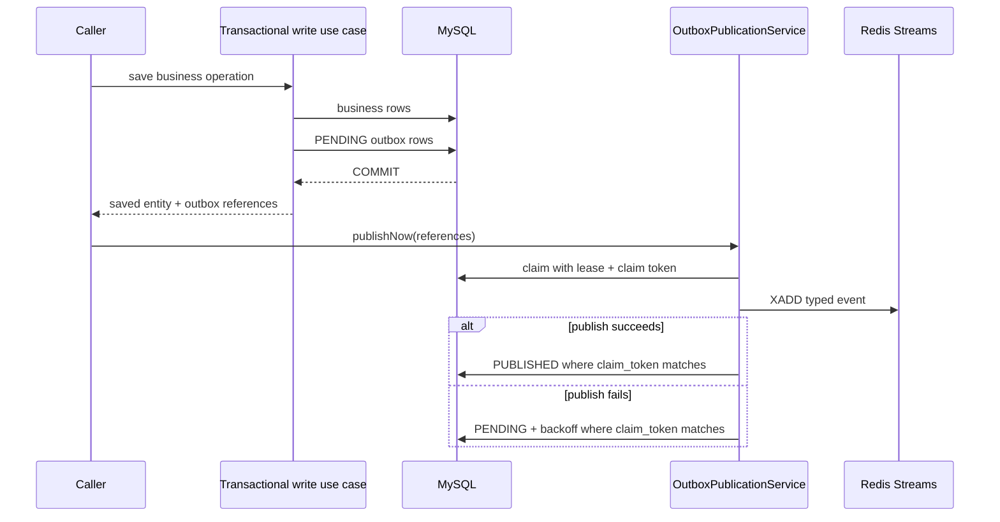
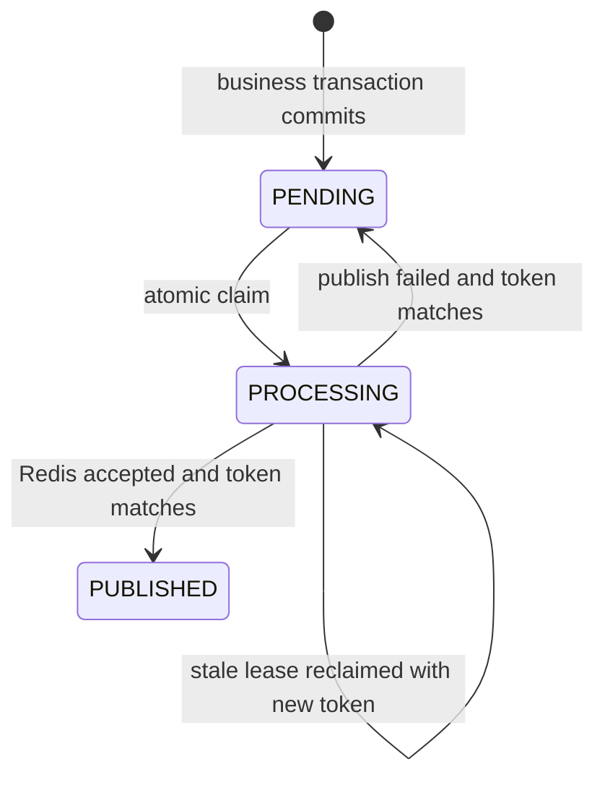

# Event Outbox Architecture

## Context

Question creation and community activity must update MySQL and publish Redis
Stream events without losing an event or delaying the normal success path
until the next polling interval. MySQL and Redis cannot participate in one
atomic transaction, so publication is explicitly at-least-once.

## Goals

- Commit the business change and its `PENDING` outbox rows in one R2DBC
  transaction.
- Attempt Redis publication immediately after that transaction commits.
- Use one publication flow for immediate delivery and scheduled recovery.
- Prevent concurrent request and scheduler workers from both owning a row.
- Recover publication failures and abandoned claims.
- Deserialize consumer payloads through Jackson using `@StreamListener`.
- Recover idle consumer-group messages through `@StreamScheduler`.

## Non-goals

- Exactly-once delivery.
- A distributed transaction between MySQL and Redis.
- Using Redis Streams as a permanent source of truth.
- Deleting shared domain-stream records after one consumer group ACKs them.

## Boundaries

Application services depend on ports:

- `QuestionCreationWriteUseCase`, `ScheduledQuestionWriteUseCase`, and
  `StudyRecordWriteUseCase` are inbound transaction boundaries.
- `RedisEventOutboxAppendPort` and `QuestionPushOutboxAppendPort` append
  durable messages.
- `PublishOutboxUseCase` performs immediate publication.
- `RecoverOutboxUseCase` performs scheduled recovery through the same
  publication service.
- `DomainEventPublishPort` and `QuestionPushPublishPort` isolate Redis.
- `AfterCommitPort` registers immediate publication after an enclosing
  reactive transaction commits.

Concrete persistence and Redis implementations remain in `infra`. Study and
scheduled-question services receive the inbound write contracts rather than
concrete write classes.

## Producer flow

The `PENDING` row is not committed independently of its business change. Both
commit together. Once they commit, a Redis failure cannot roll them back:
publication failure only schedules the outbox row for retry.

`NotificationPublicationService` can run inside another application
transaction. It appends the domain outbox row in that transaction and uses
`AfterCommitPort` to invoke `publishNow` only after the commit callback. With
no active transaction, it publishes immediately after the append. Notification
persistence/consumption remains in `NotificationService`; separating these
use-case implementations prevents the push consumer from depending back on
the outbox publisher it serves.

## Claiming and race handling

Both outbox tables use:

- `status`: `PENDING`, `PROCESSING`, or `PUBLISHED`;
- `next_attempt_at`;
- `claimed_at`;
- `claim_token`;
- attempt count and last error.

An eligible worker atomically changes a due `PENDING` row, or a stale
`PROCESSING` row, to `PROCESSING` with a fresh UUID claim token. Completion
and retry updates require both the row ID and that token. A request worker and
the recovery scheduler may race, but only the claim winner can publish and
change state. If a lease expires, the new token fences the old worker from
overwriting the new owner.

The application cannot atomically couple Redis acceptance to the final MySQL
update. A crash after `XADD` and before `PUBLISHED` can therefore publish a
duplicate during recovery. Stable event IDs and idempotent consumers are
required.

## Recovery

`OutboxRecoveryScheduler` runs the managed
`question-push-outbox-dispatch` job name for operational compatibility. Its
job calls `RecoverOutboxUseCase`, which claims batches from both
`redis_event_outbox` and `question_push_outbox`, then invokes the same
publication and fenced status-update methods used by `publishNow`.

Retry delay uses bounded exponential backoff. A two-minute publication claim
lease recovers process crashes. Stream-consumer idle recovery is separate:
`@StreamScheduler` uses Redis `XAUTOCLAIM` after five minutes and executes the
same typed handler as the corresponding `@StreamListener`.

## Consumer flow

- `@StreamListener` declares topic, group, consumer, event type, Jackson
  payload type, batching, concurrency, and completion option.
- Jackson conversion or handler failure leaves the record pending.
- `StreamOptions.ACK` acknowledges a shared domain event without deleting it.
- `StreamOptions.ACK_DEL` acknowledges and deletes a successful dedicated
  push record atomically through one Redis Lua script request.
- Notification persistence deduplicates by `eventId`.
- Push persistence/claiming prevents two consumers from sending the same
  notification concurrently; provider calls still follow at-least-once
  semantics across an unrecoverable process boundary.

## Failure modes

| Failure | Result |
| --- | --- |
| Business transaction rolls back | Business rows and new outbox rows both roll back |
| Redis unavailable after commit | Request keeps its committed business result; outbox returns to `PENDING` |
| Request and scheduler race | One claim token wins |
| Worker dies in `PROCESSING` | Lease expires and scheduler reclaims |
| Crash after `XADD`, before status update | Event may be republished; consumer event ID deduplicates |
| Consumer handler fails | No ACK; idle recovery retries |
| Unsupported payload version | Producer row remains retryable and exposes the error |

## Observability

Track outbox counts by status, oldest pending age, attempts, `last_error`,
consumer pending counts, and stream length. The existing monitoring Event
Streams view exposes both durable outbox tables and Redis consumer groups.

## Verification

Tests cover:

- transactional rollback of a business write and its outboxes;
- immediate claim, publication, and completion;
- retry after publication failure;
- concurrent claim with one winner;
- claim-token fencing and stale lease recovery;
- after-commit callback ordering;
- typed stream listener and scheduler configuration;
- MySQL and H2 schema migrations plus AOT reflection hints.
