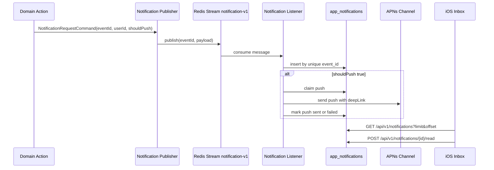

# BuddyStudy Notification System

## Context

BuddyStudy has two related but separate concepts:

- **In-app notification**: a durable inbox item stored in the backend database and shown in the iOS app.
- **Push notification**: an optional delivery channel used to wake or alert a device for selected in-app notifications.

An in-app notification can exist without a push. Push delivery can fail without deleting or rolling back the in-app notification.

## Goals

- Store user-visible activity notifications durably.
- Render notifications from the iOS home toolbar with unread count, read state, deletion, clear all, and offset pagination.
- Process notification creation through Redis Stream prefix `notification-v1`.
- Avoid duplicate in-app notifications when the same event is consumed more than once.
- Allow each notification event to decide whether APNs push should be sent.

## Non-Goals

- True end-to-end exactly-once push delivery. APNs is an external channel, so the backend cannot prove exactly-once delivery to a device.
- macOS notification UI.

## Proposed Architecture

## Data Model

`app_notifications` is the source of truth.

Important columns:

- `event_id`: unique idempotency key for event processing.
- `user_id`: notification owner.
- `actor_user_id`: user who caused the activity, if any.
- `type`: activity type, such as `THREAD_ACTIVITY`.
- `title`, `body`: display copy.
- `thread_type`, `thread_id`: target aggregate.
- `deep_link`: optional app route.
- `should_push`: whether the notification should also be pushed.
- `push_claimed_at`, `push_sent_at`, `push_error`: push channel state.
- `read_at`: read state.
- `deleted_at`: soft deletion.

## API Contracts

- `GET /api/v1/notifications?limit=30&offset=0`
  - Returns visible notifications, unread count, total count, and pagination values.
- `GET /api/v1/notifications/unread-count`
  - Returns only unread count for home toolbar badge.
- `POST /api/v1/notifications/{id}/read`
  - Marks a notification as read for the authenticated owner.
- `DELETE /api/v1/notifications/{id}`
  - Soft-deletes one notification.
- `DELETE /api/v1/notifications`
  - Soft-deletes all notifications for the authenticated user.

## Event Contract

Stream prefix: `notification-v1`

Primary fields:

- `eventId`
- `eventType = NOTIFICATION_REQUESTED`
- `userId`
- `payload`

`payload` contains the same values as `NotificationRequestCommand`.

## Consistency and Ordering

- In-app notification creation is **effectively once** per `event_id`.
- Redis Stream consumption is treated as at-least-once.
- Duplicate stream delivery is safe because `app_notifications.event_id` is unique and the processor returns the existing notification id on duplicate.
- Ordering is best-effort by `created_at desc, id desc` for display.

## Push Delivery Semantics

Push is a separate channel from the inbox.

- `should_push=false`: only the inbox item is created.
- `should_push=true`: listener attempts APNs delivery after the inbox item is stored.
- Push claim uses `push_claimed_at` and permits retry of stale claims after five minutes.
- If the process crashes after APNs accepts the push but before `push_sent_at` is written, a later retry may send another push. This is the unavoidable tradeoff without APNs-side dedupe acknowledgement.
- The in-app notification remains exactly one visible item.

## Failure Handling

- Stream consumer failure: message is nacked and retried.
- DB duplicate event id: processor returns the existing notification id.
- Push failure: `push_error` is recorded; the notification still remains in the inbox.
- Device without APNs token: push is marked failed with a clear reason.

## Scalability

- Inbox queries are indexed by `(user_id, deleted_at, created_at desc, id desc)`.
- Unread count is indexed by `(user_id, read_at, deleted_at)`.
- Stream partitioning is by `userId`, keeping per-user activity mostly localized.
- iOS renders pages lazily and loads more when the last row appears.

## iOS Behavior

- Home toolbar shows a bell button with unread badge.
- Opening the bell navigates to the notification inbox page.
- Tapping a row marks it read and follows its `deepLink` if present.
- Rows can be deleted individually, and the toolbar exposes clear-all.
- Startup unread-count failures do not interrupt home with a login prompt; explicit inbox access shows the relevant state.

## Test Plan

- Backend unit tests cover event idempotency, read/delete mutations, pagination filtering, and stream publisher delegation.
- Community service tests cover notification publishing for likes and comments.
- iOS build verifies API models and inbox UI compile for the iOS target.
