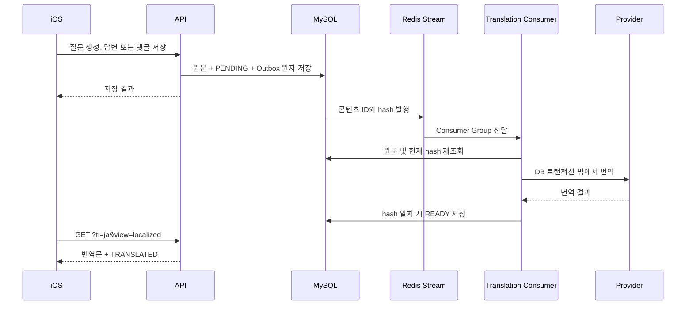

# BuddyStudy 콘텐츠 로컬라이제이션

## 지원 범위

BuddyStudy는 앱 UI와 동적 콘텐츠 모두 한국어(`ko`), 영어(`en`), 일본어(`ja`)를 지원한다.

- 정적 UI는 iOS `AppStrings`가 담당한다.
- 질문, 사용자 답변, AI 채점 응답, 댓글은 백엔드 콘텐츠 로컬라이제이션 파이프라인이 담당한다.
- 원문은 변경하지 않는다. 번역문은 언어별 읽기 모델에만 저장한다.
- Markdown은 저장된 문자열을 그대로 MarkdownUI로 렌더링한다. 저장 전 정규화나 임의 문자열 치환을 하지 않는다.

## 언어 모델

각 콘텐츠는 독립적인 원본 언어를 가진다.

| 콘텐츠 | 원본 언어 |
|---|---|
| 주제·질문·힌트 | `questions.source_language` |
| 사용자 답변 | `questions.answer_source_language` |
| AI 피드백·설명·채점 근거 | `questions.ai_response_source_language` |
| 댓글 | `question_comments.source_language` |

콘텐츠가 존재하면 원본 언어도 반드시 존재한다. 아직 답변이나 AI 응답이 없다면 해당 언어 컬럼은 `NULL`이다.

번역문은 다음 읽기 모델에 저장한다.

| 읽기 모델 | 번역 대상 |
|---|---|
| `question_localizations` | 주제·질문·힌트 |
| `answer_localizations` | 사용자 답변 |
| `grading_localizations` | 피드백·설명과 사용자 노출 채점 문구 |
| `question_comment_localizations` | 댓글 |

각 번역 행은 원본 ID와 대상 언어를 유일 키로 가지며 `source_language`, `source_hash`, `status`, `provider`, `translation_version`, `error`, 타임스탬프를 저장한다. 상태는 `PENDING`, `READY`, `FAILED`다.

원본과 대상 언어가 같으면 번역 행을 만들지 않는다. `ko`, `en`, `ja` 사이의 나머지 모든 방향을 지원한다.

`questions`에는 원문 필드와 위 세 원본 언어 컬럼만 존재한다. `language`, `question_en`, `topic_en`, `hint_en`, 질문 행 단위의 번역 상태 컬럼은 최종 스키마에서 제거됐다. 댓글도 `question_comments.body`에는 원문만 저장하고 번역문은 `question_comment_localizations`에서만 읽는다.

## 언어 감지

- iOS는 답변과 댓글을 제출하기 전에 `NLLanguageRecognizer`로 `ko/en/ja`를 감지한다.
- 서버는 세 언어만 로드한 Lingua 감지기로 클라이언트 값을 검증한다.
- 구버전 요청이나 기존 데이터에는 서버 감지 결과를 사용한다.
- 짧거나 판별이 어려운 사용자 입력은 현재 앱 언어를 사용한다.
- AI 질문과 채점 응답은 생성 요청 언어를 원본 언어로 기록하되 실제 출력도 서버에서 검증한다.
- 대상 언어 문자 검증은 일반 문장을 그대로 반환한 응답을 계속 거부한다. 다만 코드, API 경로,
  약어, 예외명처럼 번역하지 않는 것이 맞는 문자열은 원문과 결과가 정확히 같고 전체가 기술
  토큰으로 구성된 경우에만 `identity` 번역으로 즉시 완료하며 외부 공급자를 호출하지 않는다.

## 조회 API

기록, 대기 질문, 공개 질문과 댓글 API는 다음 쿼리를 지원한다.

```text
tl=ko|en|ja
view=localized|original
```

- `tl`은 Reddit의 `tl`과 같은 표시 언어 선택 값이다.
- 기존 `language`는 임시 호환 별칭이며, 둘 다 있으면 `tl`이 우선한다.
- `view=localized`가 기본값이다.
- `view=original`은 질문, 답변, AI 응답, 댓글 원문을 반환하며 번역 작업을 만들지 않는다.
- `tl`이 없으면 인증 사용자의 앱 언어, 요청 locale, 한국어 순으로 결정한다.

기존 문자열 필드는 실제 화면에 표시할 문자열을 계속 반환한다. 신규 클라이언트는 함께 반환되는 메타데이터로 번역 상태와 원문 전환 가능 여부를 판단한다.

```json
{
  "localization": {
    "question": {
      "sourceLanguage": "en",
      "requestedLanguage": "ja",
      "displayLanguage": "ja",
      "translationState": "TRANSLATED",
      "isTranslated": true,
      "originalAvailable": true,
      "translationReason": "EXPLICIT_TL"
    }
  }
}
```

응답 상태는 다음 네 가지다.

| 상태 | 의미 |
|---|---|
| `ORIGINAL` | 요청 언어와 원본 언어가 같거나 원문 보기를 요청함 |
| `TRANSLATED` | 요청 언어의 준비된 번역을 반환함 |
| `PENDING` | 번역을 등록하고 원문을 즉시 반환함 |
| `FAILED` | 마지막 번역이 실패해 원문을 반환함 |

`displayLanguage`는 실제 반환 문자열의 언어다. 따라서 대기 또는 실패 상태에서는 `requestedLanguage`와 다를 수 있다. 댓글은 각각 독립된 메타데이터를 가진다.

인증 사용자가 직접 작성한 답변도 질문·채점 응답과 동일하게 요청한 표시 언어로 반환한다. 따라서 작성자 본인 화면에서도 준비된 답변 번역을 사용하며, `view=original`을 선택했을 때만 원문을 반환한다. 댓글은 작성자에게 원문을 유지하고 `translationState=ORIGINAL`, `translationReason=AUTHOR_ORIGINAL`을 사용한다.

답변과 댓글 쓰기 요청은 구버전과 호환되도록 선택 필드를 추가한다.

```json
{ "answer": "...", "sourceLanguage": "ja" }
{ "body": "...", "sourceLanguage": "ja" }
```

## 비동기 번역

번역 작업은 쓰기 시점에 먼저 생성한다. 직접 질문과 예약 질문의 생성 완료, 사용자 답변 저장, AI 채점 완료, 댓글 저장은 원문 변경과 같은 DB 트랜잭션 안에서 지원 언어별 `PENDING` 행과 `CONTENT_TRANSLATION_REQUESTED` Outbox를 함께 저장한다. 커밋 후 즉시 publish를 시도하며, 실패하거나 프로세스가 종료되면 공용 Outbox recovery가 이어서 발행한다.

조회 경로는 read-repair를 유지한다. 과거 데이터나 장애 때문에 번역이 누락된 경우 작은 별도 트랜잭션에서 같은 작업을 idempotent하게 보완하고 원문을 즉시 반환한다. 질문, 사용자 답변, AI 응답, 댓글은 각각 `QUESTION`, `ANSWER`, `AI_RESPONSE`, `COMMENT` 이벤트를 가지며 독립적으로 번역·재시도·실패 처리된다. 과거의 `RECORD` 이벤트는 배포 전 생성된 메시지를 비우기 위한 소비 호환 타입일 뿐 새로 발행하지 않는다. 각 번역 행의 durable request token이 Outbox 이벤트 ID를 결정하므로 쓰기와 동시 조회가 경합해도 하나의 이벤트로 수렴한다. 5분 이상 멈춘 `PENDING` 또는 `FAILED` 행은 새 token으로 재큐잉되어 번역 공급자 장애 복구 후 다시 처리된다.



- Redis Stream은 `localization.content-translation.requested.v1`이며 전용 Consumer Group을 사용한다.
- `PENDING` 행과 Outbox를 먼저 커밋한 뒤에만 즉시 publish를 시도한다.
  publish 실패나 프로세스 종료는 공용 Outbox recovery가 재처리한다.
- 직접 생성과 예약 생성은 같은 질문 생성 완료 유스케이스를 사용하므로 동일한 번역 Outbox 정책을 적용한다.
- 사용자 답변은 채점 요청 여부와 관계없이 저장 즉시 번역 Outbox를 만들고, 채점 완료 시 새 AI 응답 부분만 추가한다.
- 댓글은 댓글 원문 저장과 번역 Outbox 생성을 한 트랜잭션에 묶는다.
- 기존 Inbox claim, 재시도, auto-claim 구조를 재사용해 at-least-once로 처리한다.
- 이벤트에는 원문을 넣지 않는다. 소비자가 콘텐츠 ID로 원문을 다시 읽는다.
- source hash가 달라진 오래된 이벤트는 새 원문을 덮어쓰지 않고 성공 처리한다.
- 외부 번역 호출은 DB 트랜잭션 밖에서 실행한다.
- 최종 실패는 번역 행만 `FAILED`로 바꾸며 원문 노출을 유지한다.
- 장시간 `PENDING` 및 `FAILED`는 조회 시 5분 간격으로만 재큐잉해
  영구 정체를 복구하면서 장애 중 요청 폭주를 막는다.
- 번역은 질문 생성 할당량을 소비하지 않는다.

질문 레코드는 질문, 답변, AI 응답 가운데 변경되거나 누락된 부분만 번역한다. 각 부분의 hash와 이벤트가 독립적이므로 한 부분의 번역 실패가 다른 부분의 완료나 재시도를 막지 않는다. 댓글은 댓글별 이벤트로 처리한다.

## iOS 표시

상세 화면에서 번역된 항목이 하나라도 있으면 현재 앱 언어로 번역 상태와 전환 버튼을 표시한다.

```text
한국어로 번역됨 · 원문 보기
Translated into English · Show original
日本語に翻訳済み · 原文を見る
```

원문 보기는 상세 화면 전체를 한 번에 전환한다. 질문, 답변, AI 응답, 댓글 각각의 원문을 표시하며 스크롤 위치와 화면 구조를 유지한다. 원문 상태에서는 같은 위치에 `번역 보기`, `View translation`, `翻訳を見る`를 제공한다.

첫 조회가 `PENDING`이면 원문을 그대로 보여주고 1초, 2초, 4초 간격으로 최대 세 번 조용히 재조회한다. 전체 화면 로더나 빈 콘텐츠를 사용하지 않는다. 목록은 행마다 폴링하지 않고 현재 페이지를 한 번만 지연 갱신한다.

날짜, 시간, 상대 시간, 숫자는 번역문으로 저장하지 않는다. iOS가 선택된 `Locale`, `Calendar`, `TimeZone`으로 표시한다.

## 알림, 분석, 검색

- APNs와 인앱 알림의 정적 제목은 사용자의 앱 언어로 생성한다.
- 동적 Markdown 미리보기는 선택된 표시 언어의 파서 기반 평문 투영을 사용한다.
- 공개 질문 조회 분석 이벤트에는 `translationState`, `translationLanguage`, `translationReason`, 요청 ID와 각 콘텐츠의 source/display language를 기록한다.
- 분석 이벤트에는 원문이나 번역문 자체를 넣지 않는다.
- `question_search`는 `(question_id, language)`가 키인 검색 전용 읽기 모델이다. 질문, 답변, AI 응답은 각자의 원본 언어 또는 `READY` 번역 언어 행에만 반영된다.
- 질문이나 번역이 저장되면 같은 트랜잭션 흐름에서 해당 질문의 검색 행을 다시 만든다. 준비 전에는 원문으로 표시되며 해당 번역 언어 검색에는 준비 완료 후 포함된다.
- 공개 여부, 삭제 여부, 작성자의 공개 설정은 검색 문서에 복제하지 않고 조회 시 원본 테이블과 조인해 판정한다.

## 마이그레이션

1. 원본 언어 컬럼과 번역 테이블을 추가하고 기존 영어 번역을 `question_localizations(target_language=en)`으로 이관했다.
2. 기존 답변, AI 응답, 댓글의 원본 언어를 보완하고 `ko/en/ja` 제약을 적용했다.
3. 같은 원본/대상 언어의 불필요한 번역 행을 제거했다.
4. 원문과 준비된 번역에서 `question_search`를 전체 재구축했다.
5. `questions.language`, `question_en`, `topic_en`, `hint_en`, `translation_status`, `translation_error`를 제거했다.
6. 이후 쓰기는 원문 테이블과 각 localization 테이블만 사용하며 영어 전용 dual-write나 백필 작업은 실행하지 않는다.

## 검증 기준

- `ko/en/ja` 모든 번역 방향과 혼합 언어 상세 응답
- 동시 누락 조회의 Outbox 중복 제거
- Redis 재전달과 Inbox lease recovery
- 원문 변경 후 source hash 무효화
- 번역 실패 시 원문 fallback
- Markdown 목록, 강조, 코드, URL, 기술 용어 보존
- 모든 iOS 문자열의 일본어 제공과 일본어 줄바꿈·접근성
- 원문 전환, 조용한 재조회, 행 높이와 스크롤 위치 유지
- 백엔드 전체 로컬 테스트, iOS generic build, 실제 iPhone 실행

운영 LibreTranslate는 `Deploy BuddyStudy Translation Server` 전용
워크플로가 `buddystudy-net` 내부에 배포한다. 백엔드는
`http://buddystudy-libretranslate:5000`을 사용하며, 번역 컨테이너의
포트는 호스트나 인터넷에 공개하지 않는다. 모델 캐시는 전용 Docker
volume에 유지하고 `ko`, `en`, `ja`만 로드한다.

운영 관리 화면의 `Service Status`에서는 관리자가 요청할 때만
LibreTranslate의 `/languages`와 OpenAI의 인증된 `/v1/models`를 병렬로
호출한다. 이 확인은 번역이나 토큰 생성을 수행하지 않으며 공급자별 상태,
응답 시간, 안전하게 정규화한 실패 사유를 독립적으로 보여준다. 한 공급자의
장애가 다른 공급자의 확인 결과를 가리지 않는다.
