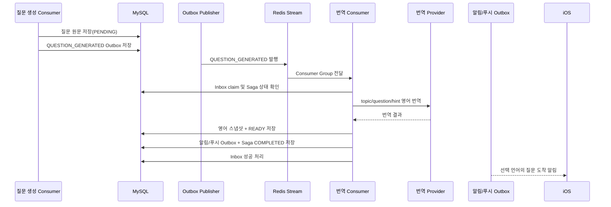
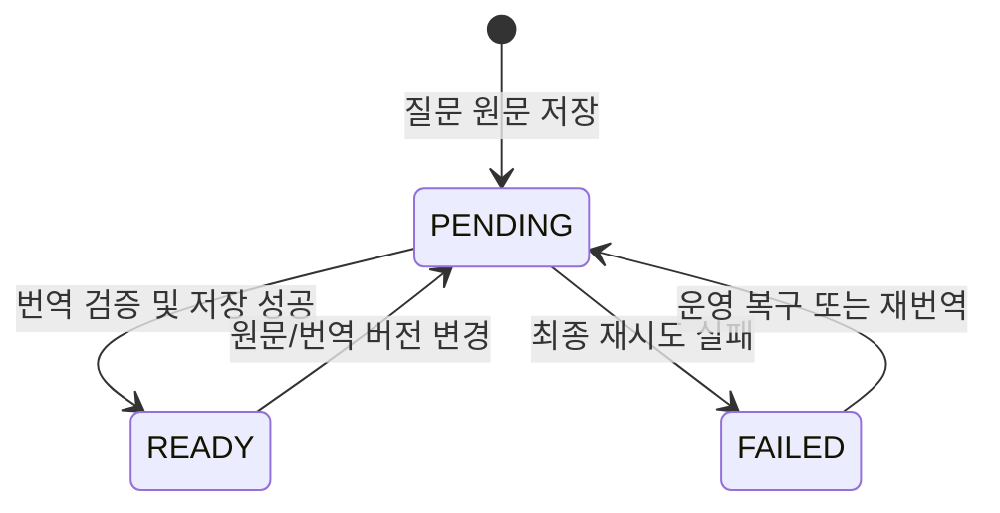

# BuddyStudy 로컬라이제이션 설계

## 1. 문서 목적

이 문서는 BuddyStudy가 사용자의 언어 설정에 맞춰 UI와 학습 콘텐츠를 일관되게 제공하기 위한 기준을 정의한다.

현재 제품이 공식 지원하는 언어는 다음 두 가지다.

- 한국어(`ko`)
- 영어(`en`)

이 문서는 현재 구현된 한국어·영어 구조와 향후 세 번째 언어를 추가할 때의 확장 구조를 구분한다. 문서에서 **현재**는 코드와 데이터베이스에 반영된 동작을, **확장 단계**는 다음 언어 추가 전에 적용해야 할 목표 구조를 의미한다.

## 2. 설계 원칙

### 2.1 UI 문자열과 콘텐츠 번역을 분리한다

로컬라이제이션 대상을 두 종류로 분리한다.

| 구분 | 예시 | 관리 주체 |
|---|---|---|
| 정적 UI 문자열 | 홈, 기록, 통계, 저장, 오류 안내 | iOS `AppStrings` |
| 동적 콘텐츠 | 학습 주제, 질문, 힌트, 채점 피드백, 알림 내용 | 백엔드와 콘텐츠 번역 파이프라인 |

백엔드가 화면 버튼이나 탭 이름을 번역하지 않고, iOS가 질문 본문을 임의로 번역하지 않는다. 이 경계를 지켜야 같은 문구가 화면마다 다르게 번역되는 문제를 방지할 수 있다.

### 2.2 원문을 단일 진실 공급원으로 유지한다

질문의 원문은 `questions.language`, `topic`, `question`, `hint`다. 번역문은 원문에서 다시 생성할 수 있는 파생 데이터다.

- 원문 수정 또는 생성 프롬프트 변경 시 번역을 무효화할 수 있어야 한다.
- 번역 실패가 원문 질문을 손상시키면 안 된다.
- 번역문은 검색·피드·알림을 빠르게 제공하기 위한 읽기 모델로 취급한다.

### 2.3 한 콘텐츠 묶음은 같은 번역 결과를 사용한다

질문의 `topic`, `question`, `hint`는 한 번의 번역 요청으로 함께 처리한다. 피드의 주제명과 질문 본문이 서로 다른 용어를 쓰거나, 화면과 푸시 알림의 번역이 달라지는 것을 방지하기 위해서다.

번역 결과는 필요한 필드가 모두 유효할 때만 `READY`가 된다. 일부 필드만 번역된 혼합 결과를 정상 번역으로 노출하지 않는다.

### 2.4 사용자 작성 내용은 자동 번역하지 않는다

다음 내용은 사용자가 명시적으로 번역을 요청하는 기능이 생기기 전까지 원문 그대로 제공한다.

- 사용자가 제출한 답변
- 댓글
- 프로필 소개
- 사용자가 직접 입력한 학습 주제

사용자 작성물을 자동 번역하면 작성 의도와 표현을 훼손할 수 있고 번역 비용도 예측하기 어렵다.

## 3. 언어 결정 규칙

동적 콘텐츠의 응답 언어는 아래 순서로 결정한다.

1. API 요청의 명시적 `language` 파라미터
2. 인증 사용자의 `appLanguage`
3. 기기 또는 요청 언어의 기본 언어 코드
4. 지원하지 않는 언어일 경우 한국어 원문

언어 코드는 BCP 47 전체 값을 저장하더라도 콘텐츠 선택 시 기본 언어로 정규화한다.

```text
ko-KR -> ko
en-US -> en
en-GB -> en
```

iOS는 공개 질문, 기록, 질문 상세와 같은 콘텐츠 API에 현재 `AppLanguage.backendCode`를 전달한다. 로그인하지 않은 사용자도 기기에서 선택한 언어로 공개 콘텐츠를 볼 수 있어야 한다.

날짜와 시간은 번역된 문자열로 저장하지 않는다. 백엔드는 `Instant`를 반환하고 iOS가 사용자의 `Locale`, `Calendar`, `TimeZone`을 사용해 표시한다. 따라서 같은 이벤트가 한국어에서는 `4분 전`, 영어에서는 `4 min. ago`로 표현된다.

## 4. 현재 질문 번역 데이터 모델

현재 한국어·영어만 지원하므로 `questions` 테이블에 영어 파생 스냅샷을 저장한다.

| 컬럼 | 의미 |
|---|---|
| `language` | 원문 언어 |
| `topic` | 원문 주제 |
| `question` | 원문 질문 |
| `hint` | 원문 힌트 |
| `topic_en` | 영어 주제 |
| `question_en` | 영어 질문 |
| `hint_en` | 영어 힌트 |
| `translation_status` | `PENDING`, `READY`, `FAILED` |
| `translation_error` | 마지막 번역 실패 원인 |

영어로 생성된 질문은 원문을 영어 스냅샷에 그대로 복사하고 `READY`로 처리한다. 한국어 질문은 비동기 번역이 완료된 뒤 영어 스냅샷을 저장한다.

`topic_en`, `question_en`, `hint_en`는 캐시 성격의 파생 데이터이며 원문보다 우선하지 않는다.

## 5. 질문 생성과 번역 처리 순서

질문 생성과 번역은 하나의 긴 데이터베이스 트랜잭션으로 묶지 않는다. 생성 결과를 Outbox와 Redis Stream으로 전달하고, 번역 소비자가 독립적으로 처리한다.



현재 구현의 주요 구성 요소는 다음과 같다.

| 역할 | 구현 |
|---|---|
| 이벤트 | `QuestionGeneratedEvent` |
| 애플리케이션 처리 | `QuestionTranslationService` |
| 트랜잭션 쓰기 경계 | `QuestionTranslationExecutionWriteService` |
| Stream Listener | `QuestionTranslationStreamListener` |
| 번역 포트 | `QuestionTranslationPort` |
| 제공자 장애 전환 | `ResilientQuestionTranslationAdapter` |
| 번역 Inbox Consumer Group | `bs-backend-question-translation` |

### 5.1 처리 상태



현재 번역 소비자는 이벤트 처리 시 최대 3회까지 재시도한다. 처리 중 서버가 중단되면 Inbox lease가 만료된 후 recovery consumer가 유휴 메시지를 다시 claim한다.

번역이 최종 실패하면 다음을 한 트랜잭션 경계에서 처리한다.

- `translation_status = FAILED`
- 실패 원인 저장
- 미완성 질문 비노출 처리
- 질문 생성 Saga를 `FAILED`로 전환
- 예약한 질문 사용량 환불
- Inbox를 종결 상태로 처리

이를 통해 번역되지 않은 영어 질문이 공개 피드나 푸시에 부분 노출되는 것을 막는다.

## 6. 번역 제공자 이중화

애플리케이션 서비스는 특정 번역 서비스 SDK에 의존하지 않고 `QuestionTranslationPort`만 사용한다. 인프라 계층에서 제공자 목록을 순서대로 실행한다.

현재 기본 순서는 다음과 같다.

1. `openai`
2. `libretranslate`

순서는 `BUDDYSTUDY_TRANSLATION_PROVIDER_ORDER`로 변경한다. LibreTranslate는 `BUDDYSTUDY_TRANSLATION_BASE_URL`과 선택적인 `BUDDYSTUDY_TRANSLATION_API_KEY`를 사용한다.

### 6.1 장애 전환 규칙

- 한 이벤트 처리 시 제공자별 호출은 한 번만 수행한다.
- timeout, 통신 오류, 빈 응답, 언어 검증 실패가 발생하면 즉시 다음 제공자로 이동한다.
- 제공자 클라이언트 내부에서 별도의 장기 재시도 루프를 만들지 않는다.
- 전체 이벤트 재시도와 복구는 Redis Stream Inbox lease가 담당한다.
- 모든 제공자가 실패하면 이벤트 처리를 실패시켜 Inbox 재시도 대상으로 남긴다.

이 구조는 `제공자 내부 재시도 × 이벤트 재시도`가 중첩되어 요청 수와 지연이 폭증하는 것을 막는다.

### 6.2 결과 검증

제공자 응답은 저장 전에 다음 조건을 확인한다.

- 주제명이 비어 있지 않다.
- 질문이 비어 있지 않다.
- 주제명은 짧은 영어 레이블로 판별된다.
- 질문 본문은 영어 콘텐츠로 판별된다.
- 힌트가 원문에 없으면 번역문도 `null`일 수 있다.

언어 판별은 최종 품질 평가가 아니라 잘못된 언어 또는 빈 결과를 차단하는 최소 안전장치다.

## 7. 화면별 로컬라이제이션 기준

### 7.1 정적 iOS 화면

새로운 UI 문구는 반드시 `AppStrings`에 한국어와 영어를 함께 추가한다. View 내부에 한글이나 영어 리터럴을 직접 작성하지 않는다.

검토 대상은 다음과 같다.

- 타이틀, 탭, 버튼, 메뉴
- 빈 상태와 로딩 상태
- 로그인 유도 문구
- 오류 복구 안내
- 접근성 레이블
- 삭제 확인과 설정 설명

문자열은 단어 단위 조합보다 완성된 문장 단위로 관리한다. 언어마다 어순이 다르기 때문이다.

### 7.2 질문과 주제

영어 사용자에게는 질문 본문뿐 아니라 다음 항목도 영어로 제공해야 한다.

- 공개 질문 피드의 주제명
- 질문 상세의 주제명과 힌트
- 기록 목록의 주제명
- 통계의 성장 주제
- 푸시 및 인앱 알림의 주제명

질문만 영어이고 주제명이 한국어인 혼합 화면은 정상적인 영어 로컬라이제이션으로 보지 않는다.

### 7.3 학습 트리

사용자가 직접 입력한 학습명은 원문을 유지한다. AI가 추천하거나 생성한 하위 주제는 생성 당시 선택 언어를 원문 언어로 기록한다.

다른 언어로 학습 트리를 탐색하는 기능이 필요해지면 `study_localizations` 읽기 모델을 도입한다. 사용자 원문을 덮어쓰지 않고 언어별 표시 이름을 별도로 저장한다.

### 7.4 채점 피드백

채점 피드백은 점수와 근거를 먼저 생성한 뒤 기계 번역하는 방식보다, 동일한 판정 결과를 바탕으로 사용자의 선택 언어로 직접 설명을 생성한다.

- 점수와 루브릭 판정은 언어와 무관한 구조화 데이터로 유지한다.
- 설명과 개선 조언만 선택 언어로 생성한다.
- 코드, 고유명사, 기술 용어가 번역 과정에서 변형되지 않도록 한다.

### 7.5 알림

푸시 및 인앱 알림은 이벤트 소비 시 사용자의 `appLanguage`를 기준으로 생성한다.

- 알림 타이틀과 본문을 각각 현지화한다.
- 시간은 본문에 고정 문자열로 넣지 않는다.
- 알림 클릭 후 상세 API도 같은 언어 파라미터를 사용한다.
- 알림 생성 후 사용자가 언어를 바꾸더라도 이미 발송된 APNs payload는 변경하지 않는다.
- 인앱 알림 목록은 가능한 경우 구조화된 이벤트를 저장하고 조회 시 선택 언어로 투영한다.

### 7.6 오류 메시지

백엔드는 안정적인 `errorCode`, `messageKey`, 디버그 설명을 제공한다. 앱은 화면 흐름과 복구 액션을 `errorCode`로 결정한다.

- 서버의 사용자 메시지를 표시해야 할 경우 선택 언어로 내려준다.
- 로그인 이동, 약관 동의 이동, 재시도 버튼 같은 동작은 앱에서 결정한다.
- 디버그 설명과 예외 스택은 사용자 화면에 노출하지 않는다.

## 8. 기존 데이터 Backfill

`V16__question_topic_english_translation.sql`은 `topic_en`을 추가하고 영어 원문 행의 주제를 즉시 복사한다.

기존 한국어 질문 중 `question_en`은 있지만 `topic_en`이 없는 행은 `question-topic-translation-backfill` 작업이 보완한다.

Backfill은 다음 원칙을 지킨다.

- 한 번에 설정된 batch 크기만 조회한다.
- `translation_status = READY`, `question_en` 존재, `topic_en` 누락 행만 처리한다.
- 외부 번역 호출은 데이터베이스 트랜잭션 밖에서 수행한다.
- 저장 시 `topic_en is null` 조건으로 멱등성을 보장한다.
- 관리 작업 lock을 사용해 여러 서버 인스턴스가 같은 batch를 동시에 처리하지 않는다.
- 일부 행 실패가 전체 batch 성공을 막지 않으며 다음 실행에서 재시도한다.

배포 직후 대량 번역 요청이 몰리지 않도록 batch는 항상 제한한다.

## 9. 세 번째 언어 추가를 위한 확장 모델

일본어 등 세 번째 콘텐츠 언어를 추가할 때 `topic_ja`, `question_ja`, `hint_ja`처럼 컬럼을 늘리지 않는다. 아래 정규화 테이블로 전환한다.

```text
question_localizations
- question_id
- locale
- topic
- question
- hint
- status
- provider
- source_hash
- translation_version
- error
- created_at
- updated_at

primary key (question_id, locale)
```

필드 역할은 다음과 같다.

| 필드 | 역할 |
|---|---|
| `locale` | 번역 대상 언어. 초기에는 기본 언어 코드 사용 |
| `source_hash` | 원문 변경 여부 판별 |
| `translation_version` | 프롬프트나 정책 변경 후 선택적 재번역 |
| `provider` | 품질 및 장애 분석용 제공자 식별자 |
| `status` | `PENDING`, `READY`, `FAILED` |
| `error` | 운영 진단용 마지막 실패 원인 |

학습 트리 주제에는 동일한 원칙으로 `study_localizations`를 둔다.

```text
study_localizations
- study_id
- locale
- display_name
- source_hash
- translation_version
- status
- provider
- created_at
- updated_at

primary key (study_id, locale)
```

### 9.1 확장 시 읽기 규칙

1. 요청 locale의 `READY` 번역 조회
2. 번역이 없으면 원문 언어와 요청 언어가 같은지 확인
3. 같으면 원문 반환
4. 다르면 제품 정책에 따라 원문 fallback 또는 번역 준비 상태 표시

공개 피드는 언어가 섞이지 않도록 `locale`별 조회 조건과 인덱스를 둔다. 향후 전문 검색 엔진을 도입하더라도 검색 문서와 analyzer를 locale별로 분리한다.

## 10. 캐시와 일관성

질문 번역은 생성 시점에 미리 저장하므로 일반 조회마다 외부 번역 API를 호출하지 않는다.

- 데이터베이스의 `READY` 번역이 기준이다.
- 앱은 질문 ID와 locale을 포함한 캐시 키를 사용한다.
- 원문이 바뀌면 `source_hash`가 달라져 기존 번역을 무효화한다.
- 번역 프롬프트가 바뀌면 `translation_version`을 올려 필요한 콘텐츠만 재처리한다.
- 실패한 번역을 무기한 캐시하지 않는다.

현재 영어 컬럼 구조에서는 질문 원문을 수정할 경우 `translation_status`를 다시 `PENDING`으로 전환하고 영어 파생 필드를 재생성해야 한다.

## 11. 관측성과 개인정보 보호

현재 제공자 호출 결과는 다음 Micrometer metric으로 집계한다.

```text
buddystudy.translation.requests{provider="openai",outcome="success"}
buddystudy.translation.requests{provider="libretranslate",outcome="failure"}
```

추가로 관찰해야 할 지표는 다음과 같다.

- locale별 번역 요청 수
- 제공자별 성공률과 latency
- provider failover 횟수
- 번역 Inbox 재시도·최종 실패 수
- `PENDING` 및 `FAILED` 적체량
- 번역 생성부터 알림 Outbox 저장까지의 end-to-end latency
- Backfill 처리량과 남은 행 수

metric label에는 질문 원문, 번역문, 사용자 ID, 이메일, API key를 넣지 않는다. 로그에도 전체 콘텐츠를 기본적으로 남기지 않고 `eventId`, `correlationId`, `questionId`, provider, 상태만 기록한다. 개발 환경에서 payload 확인이 필요하면 중앙 로깅 정책을 통해 제한적으로 활성화한다.

## 12. 번역 품질 검증

새 언어를 활성화하기 전에 고정 fixture로 자동 검증한다.

### 12.1 필수 fixture

- 일반 학습 질문
- 짧은 주제명
- Java/Kotlin/Swift 코드 블록
- SQL, HTTP 경로, JSON 필드명
- Redis, Spring, R2DBC 같은 기술 고유명사
- Markdown 목록과 강조 문법
- 숫자, 점수, 날짜 placeholder
- 힌트가 없는 질문
- 한국어와 영어가 섞인 원문

### 12.2 자동 검증 기준

- 결과가 비어 있지 않다.
- 요청 언어와 결과 언어가 일치한다.
- 코드 블록과 inline code가 보존된다.
- URL, API 경로, 변수명, 숫자가 임의 변경되지 않는다.
- placeholder 개수와 이름이 유지된다.
- 주제명이 UI 최대 길이를 과도하게 넘지 않는다.
- 금칙어 또는 prompt instruction이 번역 결과에 노출되지 않는다.

### 12.3 수동 검토 기준

언어 출시 전 표본을 검토해 다음을 확인한다.

- 질문과 힌트가 자연스럽게 연결되는가
- 기술 용어가 업계 표현과 일치하는가
- 난이도와 말투가 원문과 같은가
- 정답을 암시하거나 의미를 추가·삭제하지 않았는가
- 주제명, 질문, 채점 피드백의 용어가 일관적인가

## 13. 테스트 전략

### 13.1 백엔드

- `QuestionTranslationServiceTest`: 원문 언어, 이미 완료된 번역, 재시도와 최종 실패
- `ResilientQuestionTranslationAdapterTest`: 제공자 순서, timeout, 잘못된 결과, 전체 실패
- `QuestionTranslationStreamListenerTest`: 일반 소비와 idle recovery
- locale별 공개 질문·기록·상세 API 응답 검증
- 알림·푸시 Outbox가 사용자 언어 콘텐츠를 갖는지 검증
- Backfill의 batch 제한, lock, 멱등성 검증

### 13.2 iOS

- `AppStrings`의 한국어·영어 키 누락 검사
- 공개 질문, 기록, 통계, 알림의 주제명과 본문 언어 일치
- 기기 언어와 앱 언어가 다를 때 앱 설정 우선 적용
- 언어 변경 후 캐시된 콘텐츠 재조회
- 한국어와 영어에서 긴 문구가 잘리지 않는지 확인
- locale별 날짜, 상대 시간, 숫자 표시 확인

## 14. 단계별 적용 계획

### 단계 1: 현재 한국어·영어 안정화

- 모든 정적 UI 문구를 `AppStrings`로 통합한다.
- 공개 질문의 주제·질문·힌트를 같은 언어로 제공한다.
- 기록, 통계, 알림에도 번역 주제명을 사용한다.
- 댓글 작성과 같은 기능 오류는 번역 문제와 분리해 API 계약을 검증한다.
- 영어 콘텐츠 누락과 혼합 언어 응답을 자동 테스트에 추가한다.

### 단계 2: 학습 트리와 알림 투영 정비

- AI 생성 주제의 원문 언어를 명시한다.
- `study_localizations` 도입 여부를 확정한다.
- 인앱 알림을 구조화 이벤트에서 locale별로 투영할 수 있게 정비한다.
- 번역 상태와 적체량을 Grafana에서 관찰한다.

### 단계 3: 다국어 테이블 전환

- `question_localizations`를 추가한다.
- 기존 `*_en` 데이터를 `locale = en` 행으로 이관한다.
- dual-read로 기존 컬럼과 결과가 같은지 검증한다.
- dual-write 안정화 후 읽기를 새 테이블로 전환한다.
- 충분한 관찰 기간 후 영어 전용 파생 컬럼을 제거한다.

### 단계 4: 새 언어 출시

- 번역 제공자 지원 여부와 품질 fixture를 확인한다.
- locale별 검색·피드·알림을 검증한다.
- 내부 사용자에게 먼저 feature flag로 공개한다.
- 오류율, fallback 비율, 번역 latency를 관찰한 뒤 점진 배포한다.

## 15. 완료 기준

로컬라이제이션 기능은 다음 조건을 모두 만족해야 완료된 것으로 본다.

- 앱의 정적 문구가 선택 언어에 맞게 표시된다.
- 영어 사용자의 공개 피드에서 주제명과 질문이 모두 영어다.
- 질문 상세, 기록, 통계, 알림이 같은 용어와 언어를 사용한다.
- 날짜와 상대 시간이 locale 및 timezone에 맞게 표시된다.
- 번역 제공자 장애 시 다음 제공자로 전환되고, 모두 실패하면 복구 가능한 상태로 남는다.
- 서버 재시작 후에도 Inbox recovery가 미완료 번역을 이어서 처리한다.
- 부분 번역이 `READY`로 노출되지 않는다.
- 사용자 답변과 댓글은 동의 없이 자동 번역되지 않는다.
- 새로운 언어 추가 시 질문 테이블에 언어별 컬럼을 추가하지 않는다.
- 번역 metric과 로그에 개인정보 및 원문 콘텐츠가 포함되지 않는다.
