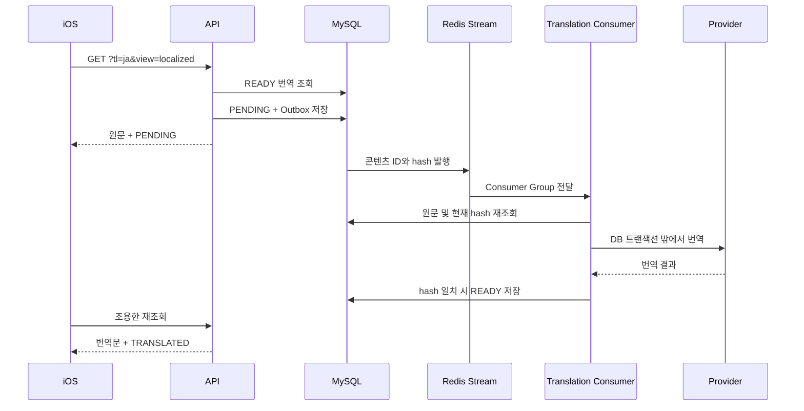

# BuddyStudy 콘텐츠 로컬라이제이션

## 지원 범위

BuddyStudy는 앱 UI와 동적 콘텐츠 모두 한국어(`ko`), 영어(`en`), 일본어(`ja`)를 지원한다.

- 정적 UI는 iOS `AppStrings`가 담당한다.
- 질문, 사용자 답변, AI 채점 응답, 댓글은 백엔드 콘텐츠 로컬라이제이션 파이프라인이 담당한다.
- 원문은 변경하지 않는다. 번역문은 언어별 읽기 모델에만 저장한다.
- Markdown은 저장된 문자열을 그대로 MarkdownUI로 렌더링한다. 저장 전 정규화나 임의 문자열 치환을 하지 않는다.

## 언어 모델

각 콘텐츠는 독립적인 원본 언어를 가진다.

| 콘텐츠 | 원본 언어 |
|---|---|
| 주제·질문·힌트 | `questions.source_language` |
| 사용자 답변 | `questions.answer_source_language` |
| AI 피드백·설명·채점 근거 | `questions.ai_response_source_language` |
| 댓글 | `question_comments.source_language` |

콘텐츠가 존재하면 원본 언어도 반드시 존재한다. 아직 답변이나 AI 응답이 없다면 해당 언어 컬럼은 `NULL`이다.

번역문은 다음 읽기 모델에 저장한다.

| 읽기 모델 | 번역 대상 |
|---|---|
| `question_localizations` | 주제·질문·힌트 |
| `answer_localizations` | 사용자 답변 |
| `grading_localizations` | 피드백·설명과 사용자 노출 채점 문구 |
| `question_comment_localizations` | 댓글 |

각 번역 행은 원본 ID와 대상 언어를 유일 키로 가지며 `source_language`, `source_hash`, `status`, `provider`, `translation_version`, `error`, 타임스탬프를 저장한다. 상태는 `PENDING`, `READY`, `FAILED`다.

원본과 대상 언어가 같으면 번역 행을 만들지 않는다. `ko`, `en`, `ja` 사이의 나머지 모든 방향을 지원한다.

## 언어 감지

- iOS는 답변과 댓글을 제출하기 전에 `NLLanguageRecognizer`로 `ko/en/ja`를 감지한다.
- 서버는 세 언어만 로드한 Lingua 감지기로 클라이언트 값을 검증한다.
- 구버전 요청이나 기존 데이터에는 서버 감지 결과를 사용한다.
- 짧거나 판별이 어려운 사용자 입력은 현재 앱 언어를 사용한다.
- AI 질문과 채점 응답은 생성 요청 언어를 원본 언어로 기록하되 실제 출력도 서버에서 검증한다.

## 조회 API

기록, 대기 질문, 공개 질문과 댓글 API는 다음 쿼리를 지원한다.

```text
tl=ko|en|ja
view=localized|original
```

- `tl`은 Reddit의 `tl`과 같은 표시 언어 선택 값이다.
- 기존 `language`는 임시 호환 별칭이며, 둘 다 있으면 `tl`이 우선한다.
- `view=localized`가 기본값이다.
- `view=original`은 질문, 답변, AI 응답, 댓글 원문을 반환하며 번역 작업을 만들지 않는다.
- `tl`이 없으면 인증 사용자의 앱 언어, 요청 locale, 한국어 순으로 결정한다.

기존 문자열 필드는 실제 화면에 표시할 문자열을 계속 반환한다. 신규 클라이언트는 함께 반환되는 메타데이터로 번역 상태와 원문 전환 가능 여부를 판단한다.

```json
{
  "localization": {
    "question": {
      "sourceLanguage": "en",
      "requestedLanguage": "ja",
      "displayLanguage": "ja",
      "translationState": "TRANSLATED",
      "isTranslated": true,
      "originalAvailable": true,
      "translationReason": "EXPLICIT_TL"
    }
  }
}
```

응답 상태는 다음 네 가지다.

| 상태 | 의미 |
|---|---|
| `ORIGINAL` | 요청 언어와 원본 언어가 같거나 원문 보기를 요청함 |
| `TRANSLATED` | 요청 언어의 준비된 번역을 반환함 |
| `PENDING` | 번역을 등록하고 원문을 즉시 반환함 |
| `FAILED` | 마지막 번역이 실패해 원문을 반환함 |

`displayLanguage`는 실제 반환 문자열의 언어다. 따라서 대기 또는 실패 상태에서는 `requestedLanguage`와 다를 수 있다. 댓글은 각각 독립된 메타데이터를 가진다.

답변과 댓글 쓰기 요청은 구버전과 호환되도록 선택 필드를 추가한다.

```json
{ "answer": "...", "sourceLanguage": "ja" }
{ "body": "...", "sourceLanguage": "ja" }
```

## 비동기 번역

번역 누락 조회는 작은 DB 트랜잭션 안에서 `PENDING` 행과 `CONTENT_TRANSLATION_REQUESTED` Outbox를 함께 저장한다. 질문, 사용자 답변, AI 응답은 각각 `QUESTION`, `ANSWER`, `AI_RESPONSE` 이벤트를 가지며 독립적으로 번역·재시도·실패 처리된다. 과거의 `RECORD` 이벤트는 배포 전 생성된 메시지를 비우기 위한 소비 호환 타입일 뿐 새로 발행하지 않는다. 이벤트 ID는 콘텐츠 유형, ID, 대상 언어, 해당 콘텐츠의 source hash로 결정하므로 동시 요청과 재시도가 중복 제거된다.



- Redis Stream 이름은 `content-translation`이며 전용 Consumer Group을 사용한다.
- 기존 Inbox claim, 재시도, auto-claim 구조를 재사용해 at-least-once로 처리한다.
- 이벤트에는 원문을 넣지 않는다. 소비자가 콘텐츠 ID로 원문을 다시 읽는다.
- source hash가 달라진 오래된 이벤트는 새 원문을 덮어쓰지 않고 성공 처리한다.
- 외부 번역 호출은 DB 트랜잭션 밖에서 실행한다.
- 최종 실패는 번역 행만 `FAILED`로 바꾸며 원문 노출을 유지한다.
- 번역은 질문 생성 할당량을 소비하지 않는다.

질문 레코드는 질문, 답변, AI 응답 가운데 변경되거나 누락된 부분만 번역한다. 각 부분의 hash와 이벤트가 독립적이므로 한 부분의 번역 실패가 다른 부분의 완료나 재시도를 막지 않는다. 댓글은 댓글별 이벤트로 처리한다.

## iOS 표시

상세 화면에서 번역된 항목이 하나라도 있으면 현재 앱 언어로 번역 상태와 전환 버튼을 표시한다.

```text
한국어로 번역됨 · 원문 보기
Translated into English · Show original
日本語に翻訳済み · 原文を見る
```

원문 보기는 상세 화면 전체를 한 번에 전환한다. 질문, 답변, AI 응답, 댓글 각각의 원문을 표시하며 스크롤 위치와 화면 구조를 유지한다. 원문 상태에서는 같은 위치에 `번역 보기`, `View translation`, `翻訳を見る`를 제공한다.

첫 조회가 `PENDING`이면 원문을 그대로 보여주고 1초, 2초, 4초 간격으로 최대 세 번 조용히 재조회한다. 전체 화면 로더나 빈 콘텐츠를 사용하지 않는다. 목록은 행마다 폴링하지 않고 현재 페이지를 한 번만 지연 갱신한다.

날짜, 시간, 상대 시간, 숫자는 번역문으로 저장하지 않는다. iOS가 선택된 `Locale`, `Calendar`, `TimeZone`으로 표시한다.

## 알림, 분석, 검색

- APNs와 인앱 알림의 정적 제목은 사용자의 앱 언어로 생성한다.
- 동적 Markdown 미리보기는 선택된 표시 언어의 파서 기반 평문 투영을 사용한다.
- 공개 질문 조회 분석 이벤트에는 `translationState`, `translationLanguage`, `translationReason`, 요청 ID와 각 콘텐츠의 source/display language를 기록한다.
- 분석 이벤트에는 원문이나 번역문 자체를 넣지 않는다.
- 공개 검색 읽기 모델은 준비된 번역을 `ko/en/ja`별로 반영한다. 준비 전에는 원문으로 표시되고 해당 번역 언어 검색에는 준비 완료 후 포함된다.

## 마이그레이션

1. 신규 원본 언어 컬럼과 번역 테이블을 먼저 추가한다.
2. 신규 쓰기는 기존 컬럼과 신규 모델을 함께 기록한다.
3. `questions.source_language`는 기존 `language`로 채운다.
4. 기존 영어 번역은 `question_localizations(target_language=en)`으로 이관한다.
5. 기존 답변, AI 응답, 댓글은 제한된 배치에서 Lingua로 감지한다. 불확실하면 질문 원본 언어, 작성자의 앱 언어 순으로 보완한다.
6. backfill과 shadow-read 비교 후 콘텐츠 존재 시 언어 컬럼 필수 제약을 적용한다.
7. `questions.language`, `question_en`, `topic_en`, `hint_en` 제거는 롤백 호환 기간 뒤의 별도 마이그레이션으로 진행한다.

## 검증 기준

- `ko/en/ja` 모든 번역 방향과 혼합 언어 상세 응답
- 동시 누락 조회의 Outbox 중복 제거
- Redis 재전달과 Inbox lease recovery
- 원문 변경 후 source hash 무효화
- 번역 실패 시 원문 fallback
- Markdown 목록, 강조, 코드, URL, 기술 용어 보존
- 모든 iOS 문자열의 일본어 제공과 일본어 줄바꿈·접근성
- 원문 전환, 조용한 재조회, 행 높이와 스크롤 위치 유지
- 백엔드 전체 로컬 테스트, iOS generic build, 실제 iPhone 실행

배포는 별도 승인 후에만 진행한다.
