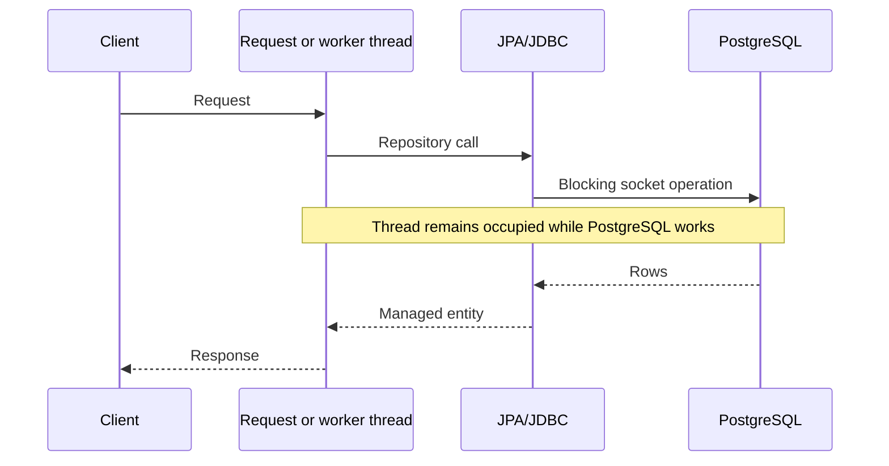
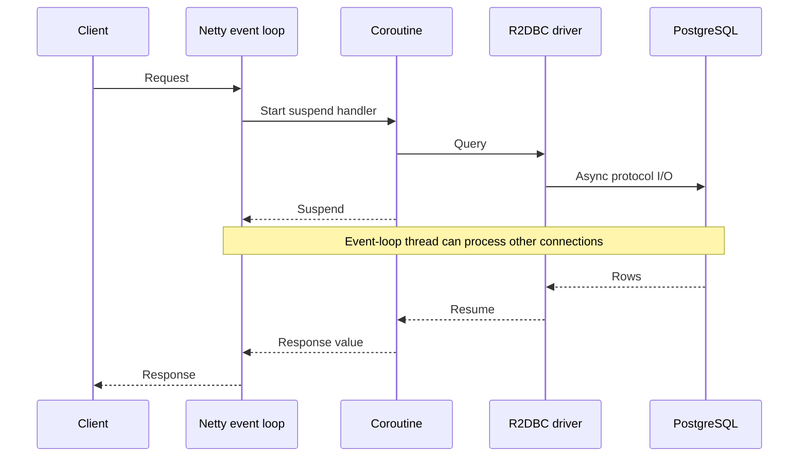

# R2DBC Persistence Migration

## Decision

BuddyStudy runtime persistence uses Spring Data R2DBC with the PostgreSQL R2DBC driver. The migration covers the complete database request path:

- WebFlux controllers and security filters call suspending inbound ports.
- Application services implement suspending use cases.
- Outbound persistence ports expose suspending operations.
- Persistence adapters use coroutine repositories, `R2dbcEntityTemplate`, or `DatabaseClient`.
- PostgreSQL connections come from `r2dbc-pool`.
- Reactive transactions are propagated through Reactor context.

JPA, Hibernate, Hikari, `JdbcTemplate`, and `EntityManager` are not used for runtime requests. Flyway deliberately keeps a JDBC connection for startup-only schema migration.

## Why The Whole Path Matters

Changing only a controller return type to `Mono` or marking a blocking repository call as `suspend` does not make database I/O non-blocking. Non-blocking behavior requires the network driver and every application boundary on the call path to support asynchronous completion.

### Before: JDBC/JPA



### After: R2DBC



## Behavioral Differences

| Area | JPA/JDBC | R2DBC in BuddyStudy | Required engineering behavior |
| --- | --- | --- | --- |
| I/O wait | Calling thread blocks | Coroutine suspends | Do not call JDBC or blocking clients on the event loop |
| Entity lifecycle | Persistence context manages entities | Returned objects are detached values | Call `save` or explicit SQL after mutation |
| Dirty checking | Flushes changed managed fields | Not available | Persist every intended update explicitly |
| Lazy loading | Proxies can load relations later | Not available | Query required data explicitly and batch related reads |
| Cascades | ORM cascade rules | No JPA cascades | Define write ordering and deletion SQL explicitly |
| Transactions | Thread-local connection | Reactor-context connection | Keep work in a reactive/suspend transaction chain |
| Repository API | `JpaRepository` | `CoroutineCrudRepository` plus explicit clients | Use `suspend`/`Flow`; avoid hidden blocking adapters |
| SQL control | ORM-generated SQL | Derived queries or explicit SQL | Inspect indexes, row counts, and query plans directly |
| Collection parameters | ORM expands collections | Driver binding is database-specific | Expand bind markers safely; never concatenate values |
| Generated IDs | ORM updates managed entity | Insert result must be returned/mapped | Use repository/template insert semantics and return saved values |
| Optimistic locking | ORM annotations/version checks | Must be modeled explicitly | Add version predicates where concurrent writes require them |

The lack of dirty checking is the largest correctness difference. Code such as `entity.markDeleted()` changes only memory until the adapter executes `save(entity)` or an explicit update statement.

## Transaction Semantics

Suspending `@Transactional` methods are backed by Spring's reactive transaction manager. The active connection is stored in Reactor context, not in a thread-local. A coroutine may resume on another thread while retaining the same transaction context.

Rules:

1. Keep all database work inside suspend/reactive calls. A nested JDBC call cannot participate safely in the reactive transaction.
2. Do not launch unstructured coroutines inside a transaction. A new scope can lose transaction context and outlive commit or rollback.
3. Keep transaction scopes short. Non-blocking execution removes blocked threads, but a long transaction still occupies one database connection and may retain locks.
4. Publish external events after commit. `afterReactiveCommit` registers a reactive transaction synchronization so Redis notifications are not visible before the corresponding rows commit.
5. Prefer a durable transactional outbox when an event must survive process failure between database commit and broker publish. An after-commit callback preserves ordering but is not a durable delivery guarantee.

## Persistence Adapter Choices

- Use `CoroutineCrudRepository` for simple single-table CRUD and derived queries.
- Use `R2dbcEntityTemplate` when entity mapping is useful but the operation needs explicit criteria, pagination, or insert/update control.
- Use `DatabaseClient` for joins, aggregates, upserts, locking/claim queries, or database-specific SQL.
- Keep SQL in outbound persistence adapters. Application services depend on outbound ports rather than R2DBC APIs.
- Use parameter binding for all values. The shared indexed-binding helper expands collection arguments into individual bind markers.
- PostgreSQL natural-key counters and read models use explicit upsert statements so concurrent updates do not rely on a read-then-insert race.

## Pool And Backpressure

Current defaults:

| Property | Default | Environment variable |
| --- | ---: | --- |
| Initial connections | 2 | `DB_POOL_INITIAL` |
| Maximum connections | 10 | `DB_POOL_MAX` |
| Maximum idle time | 30 minutes | `DB_POOL_MAX_IDLE_TIME` |
| Maximum acquisition wait | 5 seconds | `DB_POOL_MAX_ACQUIRE_TIME` |
| Runtime URL | `r2dbc:postgresql://localhost:5432/buddystudy` | `R2DBC_DATABASE_URL` |

R2DBC allows many suspended requests, but PostgreSQL still executes work through a finite number of connections. An unbounded number of accepted requests can therefore become an unbounded pending-acquisition queue. The pool, API timeout, scheduler batch size, and database connection limit must be tuned together.

Do not raise `DB_POOL_MAX` solely to improve RPS. More connections can increase context switching, lock contention, working-set memory, and query latency. First fix query plans and transaction duration, then increase concurrency only while PostgreSQL CPU, I/O, locks, and memory remain healthy.

## Flyway And Schema Compatibility

Flyway remains JDBC because it runs synchronously before request serving. Configure it separately from runtime R2DBC:

```text
R2DBC_DATABASE_URL=r2dbc:postgresql://db:5432/buddystudy
DATABASE_URL=jdbc:postgresql://db:5432/buddystudy
DATABASE_USERNAME=...
DATABASE_PASSWORD=...
```

The migration does not require a new schema format. Existing Flyway migrations remain the schema source of truth. `dev` enables Flyway by default; `prod` enables it only when `FLYWAY_ENABLED=true`.

## Remaining Blocking Boundaries

The database request path is non-blocking, but the process is not yet universally non-blocking:

- Flyway JDBC migration: startup only.
- Permission seed `runBlocking`: startup only.
- Redis stream lifecycle `.block(timeout)`: bounded start/stop lifecycle operation.
- Google OAuth, LibreTranslate, SMTP, and selected delivery integrations still use blocking client libraries in parts of the codebase.

These boundaries must be measured separately. A blocking external call on a Netty event loop can still stall unrelated requests even when the database is fully R2DBC.

## Performance Expectations

R2DBC is expected to reduce platform-thread growth when concurrency is high and requests spend meaningful time waiting for PostgreSQL. It does not guarantee higher RPS or lower latency. Results depend on query cost, pool size, transaction duration, database capacity, serialization, security lookups, external APIs, and client behavior.

Use the existing load harness at stages of 1,000, 1,500, 2,000, 2,500, and 3,000 requested RPS. Compare identical MVC/JDBC and WebFlux/R2DBC builds using:

- achieved RPS, failed requests, and dropped iterations;
- p50, p90, p95, and p99 latency;
- process CPU and CPU per successful request;
- RSS, JVM heap/non-heap, allocation rate, and GC pauses;
- total JVM threads and Reactor Netty event-loop utilization;
- R2DBC acquired, idle, pending, timeout, and acquisition latency metrics;
- PostgreSQL active connections, CPU, I/O, query latency, lock waits, and deadlocks.

Warm both variants, use the same dataset and indexes, run at least three rounds per stage, and report variance. A health endpoint or empty-table test is not representative of application persistence.

## Failure And Overload Model

- Pool acquisition timeout should fail promptly rather than retain requests until client timeouts.
- Transaction rollback occurs on exceptions propagated through the suspend/reactive chain.
- Cancellation should release subscriptions and connections; adapters must not swallow cancellation exceptions.
- Scheduler claims and outbox operations use atomic SQL/transactions to prevent duplicate workers.
- External event publication after commit can still be lost on process failure; use the transactional outbox where delivery is business-critical.

## Verification Checklist

```sh
cd backend
./gradlew test
./gradlew :tutor:bootJar
./gradlew :tutor:dependencies --configuration runtimeClasspath
```

Then verify:

- no production `JpaRepository`, `EntityManager`, `JdbcTemplate`, or Hibernate references;
- no request-path `.block()`, `runBlocking`, or JDBC data access;
- security session/device lookup suspends through R2DBC;
- mutation paths explicitly save changed relational entities;
- integration tests exercise PostgreSQL-specific SQL using Testcontainers;
- Flyway can migrate the same schema before R2DBC startup;
- rollback, generated IDs, upserts, pagination, and concurrent claim behavior are covered.

## References

- [Spring Data R2DBC reference](https://docs.spring.io/spring-data/relational/reference/r2dbc.html)
- [Spring Framework R2DBC transaction support](https://docs.spring.io/spring-framework/reference/data-access/r2dbc.html)
- [Spring Data coroutine repositories](https://docs.spring.io/spring-data/relational/reference/kotlin/coroutines.html)
