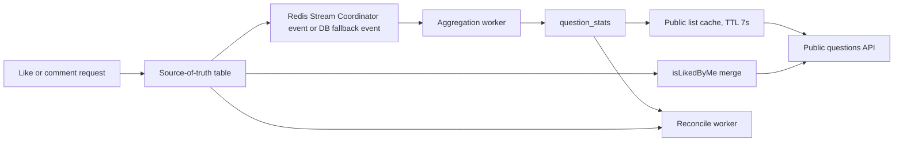

# Public Question Reaction Aggregation

## Context

BuddyStudy public questions support likes and comments. Public question lists need
`likeCount`, `commentCount`, and `isLikedByMe`, but counts from other users may be
eventually consistent. The product accepts up to about 10 seconds of delay for
counts caused by other users.

## Goals

- Keep `question_likes` and `question_comments` as the source of truth.
- Avoid hot-row counter updates on every like/comment request.
- Keep `isLikedByMe` accurate for the current user.
- Keep public list counts eventually consistent within roughly 10 seconds under
  normal operation.
- Recover correct counts if process memory, in-memory cache, or a worker loop is
  lost.

## Non-Goals

- Exactly-once delivery outside a single database transaction.
- Real-time global like/comment counts in every public list response.
- Redis as a required dependency for correctness.

## Proposed Architecture



## Component Responsibilities

- `question_likes`: current like state, unique by `(question_id, user_id)`.
- `question_comments`: current comment state, with `deleted_at` for soft delete.
- Redis Stream Coordinator stream: primary append-only reaction change queue in production.
- `question_reaction_events`: DB append-only fallback when Redis Stream Coordinator is unavailable or disabled.
- `aggregation_checkpoints`: stores the last processed reaction event ID.
- `question_stats`: materialized read model for `like_count` and
  `comment_count`.
- Public list cache: short-lived common list data cache. It does not include
  `isLikedByMe`.

## Data Model

```text
question_stats
- question_id PK
- like_count
- comment_count
- verified_at
- updated_at

question_reaction_events
- id autoincrement PK
- question_id
- user_id nullable
- event_type: LIKE_CREATED, LIKE_REMOVED, COMMENT_CREATED, COMMENT_REMOVED
- target_id nullable
- created_at

aggregation_checkpoints
- name PK
- last_event_id
- updated_at
```

## Write Flow

For likes:

```text
PUT /like
-> insert question_likes if not exists
-> publish LIKE_CHANGED to Redis Stream Coordinator when stream mode is active
-> otherwise append LIKE_CREATED DB fallback event only when insert succeeds

DELETE /like
-> delete question_likes if exists
-> publish LIKE_CHANGED to Redis Stream Coordinator when stream mode is active
-> otherwise append LIKE_REMOVED DB fallback event only when delete succeeds
```

For comments:

```text
POST /comments
-> insert question_comments
-> publish COMMENT_CHANGED to Redis Stream Coordinator when stream mode is active
-> otherwise append COMMENT_CREATED DB fallback event
```

In Redis Stream Coordinator mode, the database source-of-truth write commits
first, then the app publishes a small change event keyed by `questionId`. If the
publish fails, the API path falls back to reconciling `question_stats` for that
question from `question_likes` and `question_comments`.

In DB fallback mode, the source-of-truth row and `question_reaction_events` row
are written in the same database transaction.

Redis Stream events are invalidation/recompute triggers, not trusted counter
deltas. The worker recomputes counts from source-of-truth tables:

```text
like_count = count(question_likes where question_id = ?)
comment_count = count(question_comments where question_id = ? and deleted_at is null)
```

## Read Flow

Public list:

```text
GET /public/questions
-> read public list common data from 7-second cache when available
-> cache miss reads questions + authors + question_stats
-> merge isLikedByMe from question_likes for the current viewer
```

`isLikedByMe` is excluded from cache because it is viewer-specific.

## Consistency and Ordering

- Redis Stream delivery is at-least-once. Duplicate delivery is safe because
  stream-mode aggregation recomputes counts from source-of-truth tables instead
  of applying `+1/-1` deltas.
- DB fallback event ordering is by autoincrement `question_reaction_events.id`.
- DB fallback aggregation is at-least-once recoverable and effectively-once
  inside the `question_stats + aggregation_checkpoints` database transaction.
- Counts shown in public lists are eventually consistent.
- Current viewer like state is read from `question_likes` and remains accurate.

## Failure Handling

- If process memory or list cache is lost, public list cache is rebuilt from
  `question_stats`.
- If Redis Stream publishing fails after a successful source-of-truth DB write,
  the API path reconciles the affected `question_stats` row directly.
- If the DB fallback aggregation worker stops, `aggregation_checkpoints.last_event_id`
  preserves where processing should resume.
- If a bug or outage causes count drift, reconciliation recomputes counts from
  `question_likes` and `question_comments` and overwrites `question_stats`.

## Scalability

This design does not reduce total database writes. It changes their shape:

- Per-request writes are append-style source rows plus event rows.
- Hot counter updates are moved out of the request path.
- Many events for the same question are folded into one or a few
  `question_stats` updates.

This reduces hot-row update contention and stabilizes request latency for popular
questions.

## Observability

Track:

- aggregation events processed per cycle
- aggregation lag: max event id minus checkpoint event id
- reconcile rows per cycle
- public list cache hit rate
- public list latency
- like/comment write latency

## Rollout Plan

1. Create `question_stats`, `question_reaction_events`, and
   `aggregation_checkpoints`.
2. Backfill stats from existing likes/comments.
3. Write reaction events for future likes/comments.
4. Read public list counts from `question_stats`.
5. Run aggregation worker every 3 seconds.
6. Cache public list common data for 7 seconds.
7. Periodically reconcile stale stats from source-of-truth tables.

## Test Plan

- Duplicate likes do not emit duplicate effective count changes.
- Unlike without an existing like does not decrement counts.
- Comments increment `comment_count` after aggregation.
- Checkpoint resumes aggregation from the next event.
- Reconcile repairs incorrect `question_stats`.
- `isLikedByMe` remains accurate even when public list data is cached.

## Tradeoffs

- More tables and a worker loop are required.
- Total write rows may increase because event rows are appended.
- Counts are delayed for other users, by design.
- Correctness depends on source-of-truth tables and checkpointed replay, not on
  process memory.
