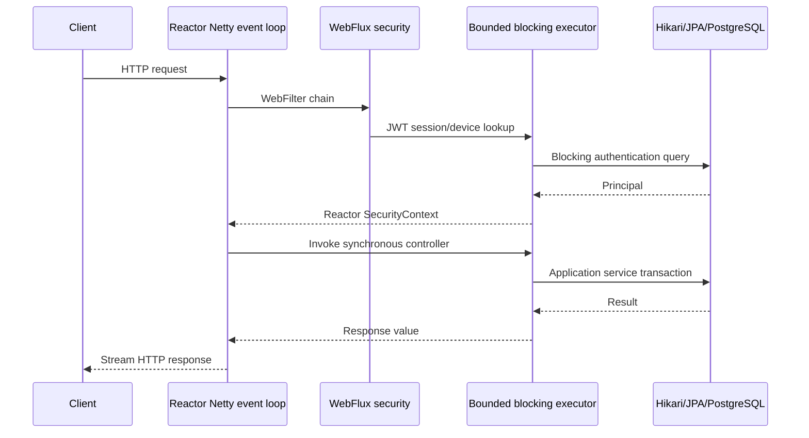

# Backend WebFlux Migration

## Decision

BuddyStudy backend now runs Spring WebFlux on Reactor Netty. The migration deliberately keeps the existing JPA/JDBC application model synchronous and transactional. Blocking controller work is dispatched to a bounded application executor instead of running on Netty event-loop threads.

This is a WebFlux HTTP runtime with isolated blocking persistence, not an end-to-end reactive database stack. Moving the persistence layer to R2DBC is a separate project because mixing reactive chains with the current JPA transaction boundaries would weaken consistency without automatically improving database throughput.

## Runtime Shape

The important boundary is the `webflux-blocking-*` executor. JPA, JDBC, synchronous OpenAI/APNs calls, and synchronous controller code must never run on `reactor-http-nio-*` threads.

## What Changed

### HTTP runtime

- Replaced `spring-boot-starter-web` with `spring-boot-starter-webflux` in the HTTP modules.
- Replaced Springdoc WebMVC artifacts with their WebFlux variants.
- Forced `spring.main.web-application-type=reactive` so a servlet runtime cannot be selected accidentally.
- Added a smoke assertion for `ReactiveWebServerApplicationContext` and for the absence of `DispatcherServlet`.

### Security and request context

- Replaced `SecurityFilterChain` and servlet filters with `SecurityWebFilterChain` and `WebFilter`.
- JWT validation and JPA-backed session/device checks run on the bounded blocking scheduler.
- Authentication is propagated through Reactor `SecurityContext`, not `SecurityContextHolder` thread-local state.
- Request-specific metadata such as app version is carried in authentication details rather than servlet request attributes.
- Anonymous routes with an expired optional token continue anonymously; protected API routes return the structured authentication error.

The authentication filter branches before composing the reactive chain. A valid authenticated request therefore invokes `chain.filter(exchange)` exactly once. Using `switchIfEmpty` after a `Mono<Void>` chain is incorrect because a successfully completed `Mono<Void>` is also empty and can execute the request twice.

### Errors

- `@RestControllerAdvice` now receives `ServerWebExchange`.
- Validation and static-resource errors use the WebFlux exception types.
- Blocking executor saturation returns `503 SERVER_BUSY` instead of being reported as an internal 500.
- Error localization and request IDs remain part of the same JSON envelope.
- Monthly quota exhaustion now uses `QUOTA_EXCEEDED`, not `OPENAI_API_KEY_MISSING`.

### Request and response logging

- Replaced servlet content-caching wrappers with reactive request/response decorators.
- The decorator forwards each `DataBuffer`; it does not aggregate the complete payload before the controller can consume it.
- Capture is limited to 8 KiB per direction. Larger bodies log a preview, observed byte count, and truncation marker.
- Authorization, client secrets, cookies, access tokens, and sensitive JSON values are redacted.
- Request/response bodies remain byte-for-byte available to downstream handlers and clients.
- One `api_exchange` event is emitted when the exchange terminates.

## MVC Versus WebFlux In Practice

| Concern | Spring MVC | Current WebFlux runtime | Practical consequence |
| --- | --- | --- | --- |
| Server model | Servlet container, normally one request thread per active request | Reactor Netty event loops for network I/O | Slow clients and streaming responses do not reserve one servlet thread each. |
| Controller model | Synchronous return values naturally run on request threads | Synchronous return values are classified as blocking and dispatched to the configured executor | Existing controller contracts can remain stable while event loops stay unblocked. |
| Security context | Usually `ThreadLocal` | Reactor context | Authentication must be attached with `contextWrite`; thread-local assumptions are invalid. |
| Filters | `Filter` / `OncePerRequestFilter` | `WebFilter` and exchange decorators | Request/response bodies are streams of `DataBuffer`, not reusable servlet streams. |
| Backpressure | Primarily container buffering | Publisher demand controls reactive body flow | Filters must forward buffers incrementally and avoid `join` on unbounded bodies. |
| Blocking JPA | Expected on request thread | Unsafe on event loop | JPA work is isolated on a bounded executor. WebFlux does not make JDBC non-blocking. |
| Transactions | Imperative `@Transactional` thread-bound transaction | Still imperative inside the blocking controller invocation | Existing transaction semantics are preserved; reactive transaction operators are not mixed with JPA. |
| Capacity limit | Servlet thread pool and accept queue | Netty connections plus blocking executor, queue, and DB pool | Each resource needs an explicit bound; otherwise WebFlux can accept more work than the database can finish. |

## Capacity And Performance

Default blocking execution settings:

| Setting | Default | Environment variable |
| --- | ---: | --- |
| Core threads | 8 | `WEBFLUX_BLOCKING_CORE_SIZE` |
| Maximum threads | 16 | `WEBFLUX_BLOCKING_MAX_SIZE` |
| Queue capacity | 64 | `WEBFLUX_BLOCKING_QUEUE_CAPACITY` |
| Idle keep-alive | 60 seconds | `WEBFLUX_BLOCKING_KEEP_ALIVE_SECONDS` |
| Hikari maximum pool | 10 | `DB_POOL_MAX` |

The blocking pool is slightly larger than the database pool because some work waits on external APIs rather than PostgreSQL. It must not be increased independently without checking Hikari capacity, database connection limits, heap usage, and external API concurrency.

The queue is intentionally bounded and short. A very large queue improves acceptance rate only by converting overload into high tail latency and memory retention. Once the pool and queue are full, new blocking work is rejected and mapped to a retryable 503 response.

### What improves

- Netty event loops remain available while JPA, JWT session validation, and external calls block elsewhere.
- Slow request/response consumers use fewer dedicated threads than the former request-per-thread runtime.
- Reactive body logging is bounded, streaming, and no longer duplicates entire large bodies in memory.
- Overload is explicit instead of silently creating an unbounded backlog.

### What does not improve automatically

- PostgreSQL throughput is still constrained by Hikari connections and query cost.
- A long JPA transaction still occupies one blocking executor thread and usually one DB connection.
- CPU-heavy work still needs a separate concurrency decision.
- Changing controller return types to `Mono` without replacing blocking internals does not improve throughput.
- R2DBC would not remove application-level contention, indexes, lock duration, or external API latency.

## Operational Checks

Watch these signals together:

1. `webflux-blocking-*` active threads, queue depth, and rejected task count.
2. Hikari active, idle, pending, and timeout counts.
3. PostgreSQL query latency, lock waits, and connection count.
4. Reactor Netty event-loop CPU and blocked-thread warnings.
5. API p50/p95/p99 latency and `SERVER_BUSY` rate.
6. OpenAI/APNs latency separately from DB latency.

Tune in this order:

1. Fix slow queries and long transaction scopes.
2. Confirm the DB can accept more concurrency.
3. Adjust `DB_POOL_MAX` if the PostgreSQL limit and host memory allow it.
4. Adjust blocking core/max threads near the useful downstream concurrency.
5. Keep the queue small enough to fail before client timeouts dominate.

## Verification

The migration is covered by:

- WebFlux request/response decorator tests, including UTF-8, nested JSON, redaction, truncation, and 500 logging.
- Reactive error-handler tests, including localized errors and executor saturation.
- Security and API integration tests running against a real Reactor Netty random port.
- A regression path that creates authenticated studies and verifies one request produces one result.
- Runtime smoke assertions that the application context is reactive and `DispatcherServlet` is absent.
- Dependency inspection confirming `spring-webmvc` is not on the runtime path.

An executable MVC/WebFlux load-test harness is documented in [`backend/loadtest/README.md`](../backend/loadtest/README.md). It compares the pre-migration MVC commit and current WebFlux runtime against disposable PostgreSQL and Redis containers with identical fixtures and JVM limits. Results are split into HTTP-only, public JPA read, and authenticated JPA read workloads; empty-database and health-only conclusions are explicitly avoided.

The first three-round measurement is recorded in [`performance/MVC_VS_WEBFLUX_2026-07-21.md`](performance/MVC_VS_WEBFLUX_2026-07-21.md). Under 50 constant local VUs, WebFlux was effectively tied on the public JPA read but was about 21% lower-throughput on the authenticated studies API. This measured regression is consistent with retaining blocking JPA while adding Reactor scheduling boundaries and must be considered before treating the migration as a performance improvement.

Subsequent comparisons must collect CPU efficiency, RSS and JVM memory pools, allocation and GC behavior, OS/JVM threads, Hikari pressure, runtime worker saturation, and PostgreSQL resource pressure for every API interval. The harness in `backend/loadtest` records these signals alongside JFR, Native Memory Tracking, and thread dumps. A runtime decision based only on RPS or average latency is incomplete.

The current comparison load is a constant arrival-rate sweep at 1,000, 1,500, 2,000, 2,500, and 3,000 RPS per API. Each stage reports achieved RPS, p90/p95/p99, failures, and dropped iterations so overload is not hidden by completed-request latency.

## Follow-up Boundary

An end-to-end reactive persistence migration should be considered only if measurements show that the bounded JPA model is the limiting factor and the required write transactions can be redesigned explicitly. That project would require R2DBC repositories, reactive transaction management, removal of `runBlocking`, reactive external clients, and new consistency/load tests. It should not be performed as a mechanical return-type conversion.
