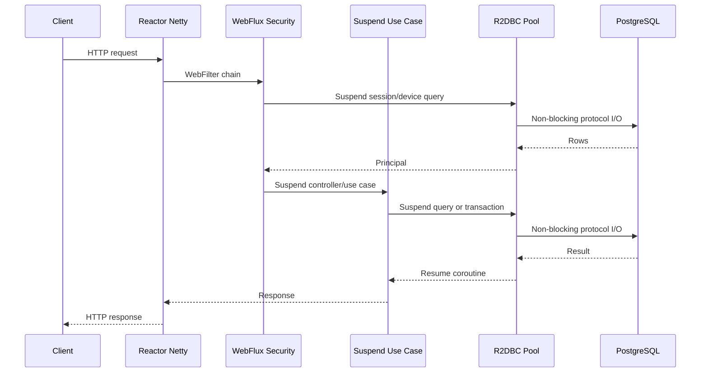

# Backend WebFlux Runtime

## Current Decision

BuddyStudy runs Spring WebFlux on Reactor Netty and uses Kotlin coroutines at the application boundary. Runtime PostgreSQL access is R2DBC, so authentication, controller, service, and database work can suspend without reserving one platform thread while waiting for database I/O.

This document describes the HTTP runtime. The persistence design, transaction semantics, migration risks, and operational tuning are documented in [R2DBC_MIGRATION.md](R2DBC_MIGRATION.md).

## Request Path



No `webflux-blocking-*` executor exists in the current runtime. Netty event-loop threads initiate asynchronous work and are released while PostgreSQL is processing it.

## MVC And WebFlux

| Concern | Spring MVC with JDBC | Current WebFlux with R2DBC |
| --- | --- | --- |
| HTTP server | Servlet request workers | Reactor Netty event loops |
| Waiting for DB | Request worker remains blocked | Coroutine suspends; driver continues asynchronously |
| Security context | Usually thread-local | Reactor context |
| Transactions | Thread-bound JDBC transaction | Reactive transaction context |
| Request body | Servlet stream/wrapper | `DataBuffer` publisher/decorator |
| Primary concurrency bound | Servlet threads and JDBC pool | R2DBC connections, pending acquisition, DB capacity |
| Overload symptom | Worker/connection queue growth | Pending pool acquisition, tail latency, timeouts |

WebFlux does not make CPU-heavy work faster. It also does not increase PostgreSQL query capacity. Its main benefit is avoiding a platform thread per waiting request when the complete call path is non-blocking.

## Boundaries

- PostgreSQL request-path I/O uses R2DBC.
- Redis data access is reactive; coroutine listeners launch suspend handlers.
- Request and response logging streams bounded payload previews without joining unbounded bodies.
- Flyway uses JDBC only during startup because migration execution is not request traffic.
- Google OAuth, LibreTranslate, SMTP, APNs, and Slack integrations are separate boundaries. Some currently use blocking clients and must not be interpreted as non-blocking merely because their caller is a suspend function. They should be migrated to reactive clients or explicitly isolated if load measurements show event-loop blocking.
- Redis stream lifecycle shutdown performs one bounded `.block(timeout)` outside request handling.
- Permission seed initialization uses `runBlocking` during application startup only.

## Verification

Use these checks after runtime changes:

```sh
cd backend
./gradlew test
./gradlew :tutor:bootJar
./gradlew :tutor:dependencies --configuration runtimeClasspath
```

The runtime classpath must include WebFlux and R2DBC and must not include Spring MVC, Spring Data JPA, Hibernate, or Hikari. The PostgreSQL JDBC driver remains intentionally present for Flyway startup migrations.

The executable comparison harness is in [backend/loadtest/README.md](../backend/loadtest/README.md). Compare MVC/JDBC and WebFlux/R2DBC using the same dataset, JVM limits, PostgreSQL instance, Redis instance, warm-up, and arrival-rate stages. A comparison based only on average response time is not sufficient.
